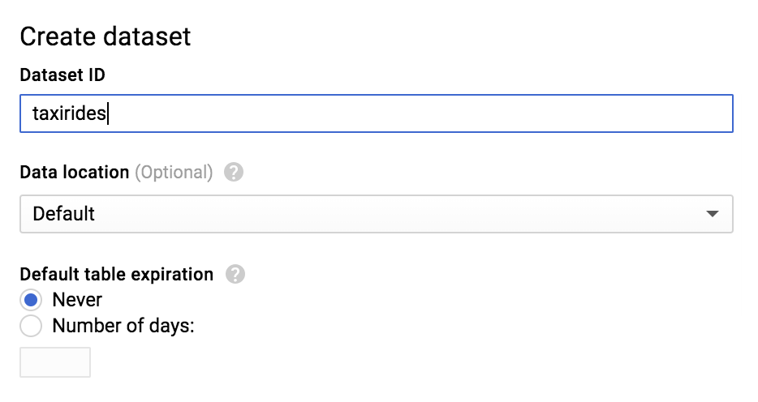
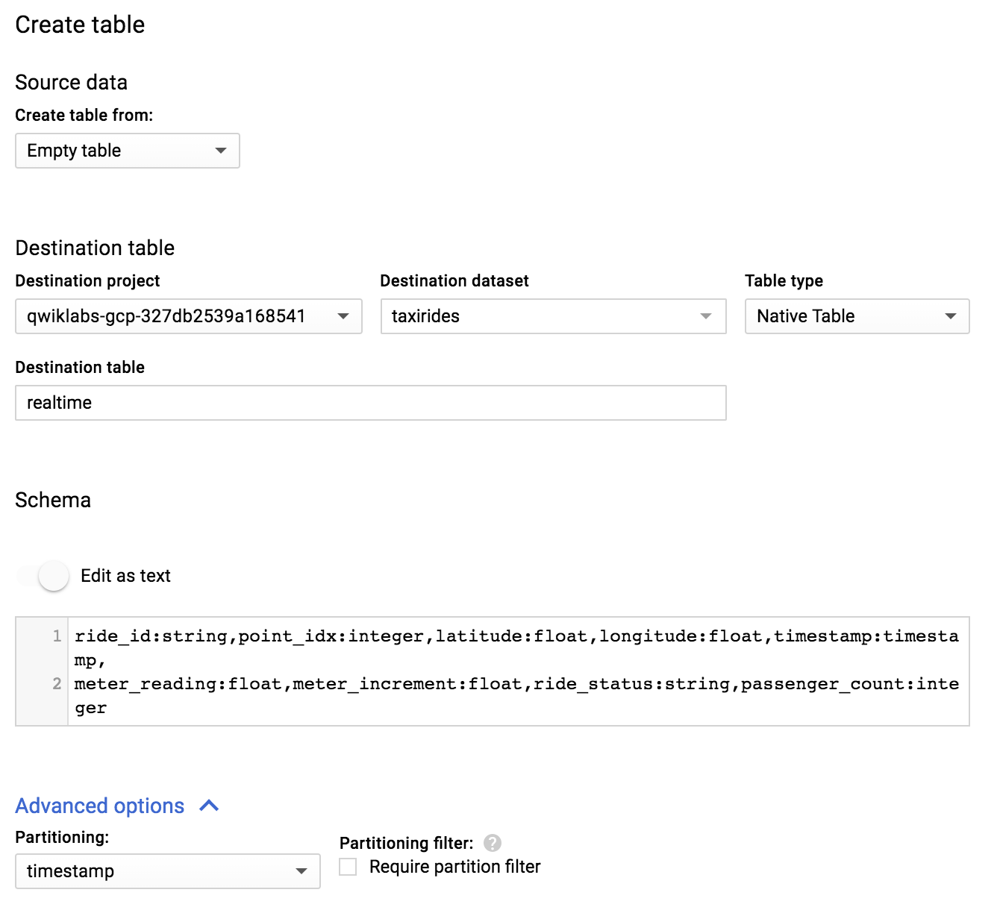
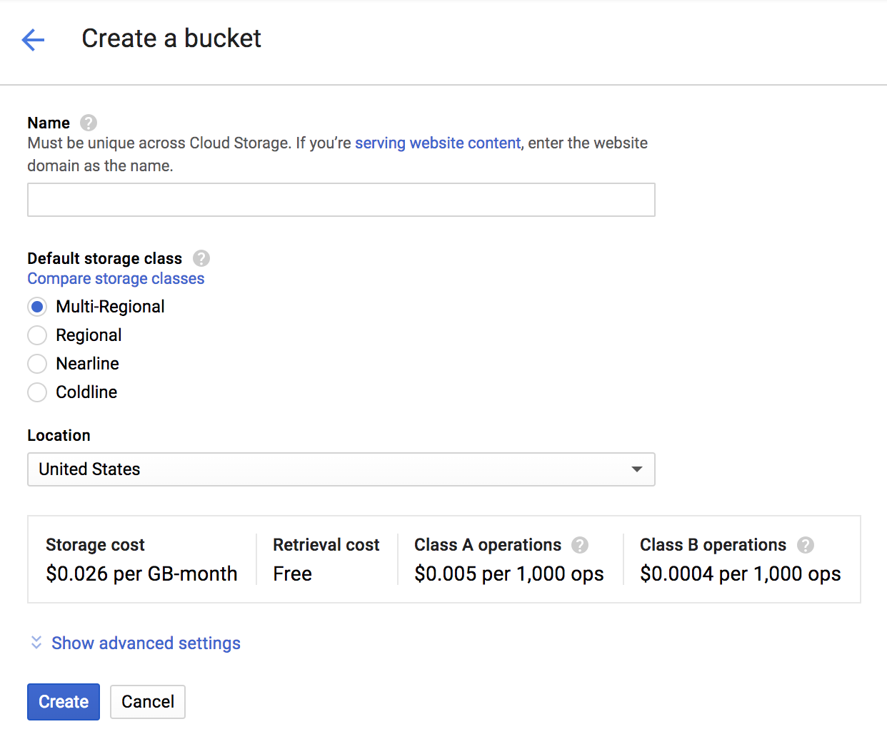
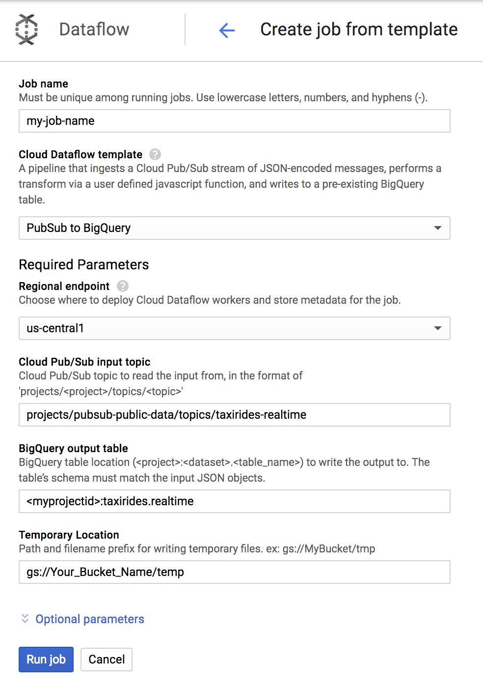
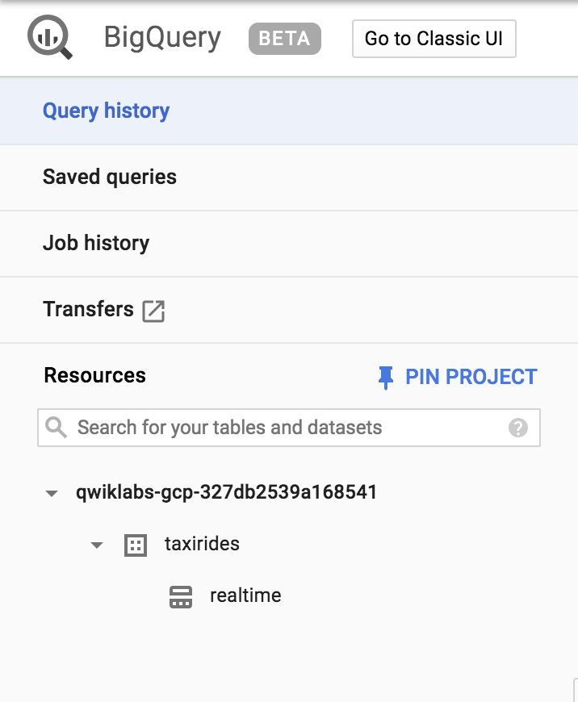
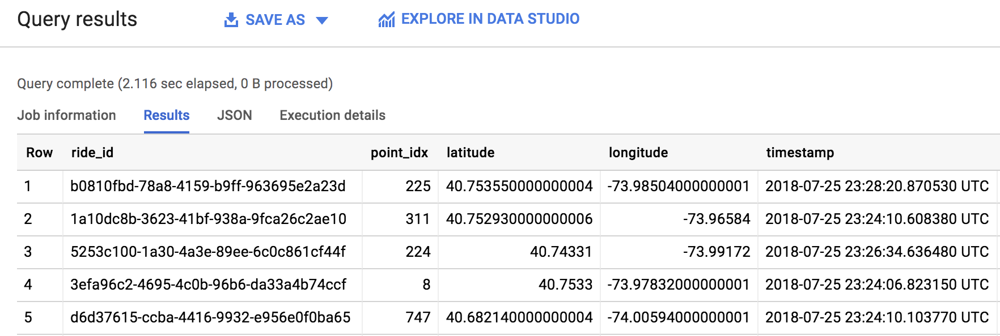

# Dataflow: Qwik Start - Templates

## GSP192


In this lab, you will learn how to create a streaming pipeline using one of [Google's Cloud Dataflow templates](https://cloud.google.com/dataflow/docs/templates/provided-templates). More specifically, you will use the Cloud Pub/Sub to BigQuery template, which reads messages written in JSON from a Pub/Sub topic and pushes them to a BigQuery table. You can find the documentation for this template here.

You'll be given the option to use the Cloud Shell command line or the GCP Console to create the BigQuery dataset and table. **Pick one method to use**, then continue with that method for the rest of the lab. If you want experience using both methods, run through this lab a second time.

---
## Setup

### Before you click the Start Lab button

Read these instructions. Labs are timed and you cannot pause them. The timer, which starts when you click Start Lab, shows how long Cloud resources will be made available to you.

This Qwiklabs hands-on lab lets you do the lab activities yourself in a real cloud environment, not in a simulation or demo environment. It does so by giving you new, temporary credentials that you use to sign in and access the Google Cloud Platform for the duration of the lab.

### What you need

To complete this lab, you need:

* Access to a standard internet browser (Chrome browser recommended).
* Time to complete the lab.
* **Note:** If you already have your own personal GCP account or project, do not use it for this lab.

### How to start your lab and sign in to the Console

1. Click the `Start Lab` button. If you need to pay for the lab, a pop-up opens for you to select your payment method. On the left you will see a panel populated with the temporary credentials that you must use for this lab.
    
2. Copy the username, and then click `Open Google Console`. The lab spins up resources, and then opens another tab that shows the **Choose an account** page.
    * **Tip:** Open the tabs in separate windows, side-by-side.
3. On the Choose an account page, click `Use Another Account`.
    
4. The Sign in page opens. Paste the username that you copied from the Connection Details panel. Then copy and paste the password.
    * **Important:** You must use the credentials from the Connection Details panel. Do not use your Qwiklabs credentials. If you have your own GCP account, do not use it for this lab (avoids incurring charges).
5. Click through the subsequent pages:
    * Accept the terms and conditions.
    * Do not add recovery options or two-factor authentication (because this is a temporary account).
    * Do not sign up for free trials.
6. After a few moments, the GCP console opens in this tab.
    * **Note:** You can view the menu with a list of GCP Products and Services by clicking the Navigation menu at the top-left, next to “Google Cloud Platform”.
    

---
## Activate Google Cloud Shell

Google Cloud Shell is a virtual machine that is loaded with development tools. It offers a persistent 5GB home directory and runs on the Google Cloud. Google Cloud Shell provides command-line access to your GCP resources.

1. In GCP console, on the top right toolbar, click the `Open Cloud Shell` button.
    
2. In the dialog box that opens, click `START CLOUD SHELL`:
    
    * **Note:** You can click `START CLOUD SHELL` immediately when the dialog box opens.
3. It takes a few moments to provision and connect to the environment. When you are connected, you are already authenticated, and the project is set to your `PROJECT_ID`. For example:
    
    * `gcloud` is the command-line tool for Google Cloud Platform. It comes pre-installed on Cloud Shell and supports tab-completion.
        * You can list the active account name with this command:
            ```bash
            $ gcloud auth list
            # Output:
            Credentialed accounts:
            - <myaccount>@<mydomain>.com (active)
            # Example output:
            Credentialed accounts:
            - google1623327_student@qwiklabs.net
            ```
        * You can list the project ID with this command:
            ```bash
            $ gcloud config list project
            # Output:
            [core]
            project = <project_ID>
            # Example output:
            [core]
            project = qwiklabs-gcp-44776a13dea667a6
            ```
    * **Note:** Full documentation of `gcloud` is available on [Google Cloud gcloud Overview](https://cloud.google.com/sdk/gcloud).

---
## Create a Cloud BigQuery Dataset and Table Using Cloud Shell

Let's first create a BigQuery dataset and table.

* **Note:** This section uses the `bq` command-line tool. Skip down if you want to run through this lab using the console.

1. Run the following command to create a dataset called taxirides:
    ```bash
    $ bq mk taxirides
    # Example output:
    Dataset '<myprojectid:taxirides>' successfully created
    ```
2. Now that you have your dataset created, you'll use it in the following step to instantiate a BigQuery table. Run the following command to do so:
    ```bash
    $ bq mk \
    --time_partitioning_field timestamp \
    --schema ride_id:string,point_idx:integer,latitude:float,longitude:float,\
    timestamp:timestamp,meter_reading:float,meter_increment:float,ride_status:string,\
    passenger_count:integer -t taxirides.realtime
    # Exmaple output:
    Table 'myprojectid:taxirides.realtime' successfully created
    ```
3. On it's face, the `bq mk` command looks a bit complicated. However, with some assistance from the [BigQuery command-line documentation](https://cloud.google.com/bigquery/docs/reference/bq-cli-reference), we can break down what's going on here. For example, the documentation tells us a little bit more about **schema**:
    * Either the path to a local JSON schema file or a comma-separated list of column definitions in the form `[FIELD]:[DATA_TYPE]`, `[FIELD]:[DATA_TYPE]`.
    * In this case, we are using the latter—a comma-separated list.

### Create a storage bucket

1. Now that we have our table instantiated, let's create a bucket. Run the following commands to do so:
    ```bash
    $ export BUCKET_NAME=<your-unique-name>
    $ gsutil mb gs://$BUCKET_NAME/
    ```
2. Once you've made your bucket, **scroll down to the "Run the Pipeline" section**.

---
## Create a Cloud BigQuery Dataset and Table Using the GCP Console

* **Note:** Don't go through this section if you've done the command-line setup!

1. From the left-hand menu, in the Big Data section, click on `BigQuery`.
2. Click on your project name in the left-hand navigation, then click `CREATE DATASET` on the right-hand side of the console. Input `taxirides` as your dataset ID:
    
3. Leave all of the other default settings in place and click `Create dataset`.
4. You should now see the taxirides dataset underneath your project ID in the left-hand console—click on it and then select `CREATE TABLE` in the right-hand side of the console.
5. In the **Destination table** input, enter `realtime`.
6. Under Schema, toggle the `Edit as text` slider and enter the following:
  ```bash
  ride_id:string,point_idx:integer,latitude:float,longitude:float,timestamp:timestamp,
  meter_reading:float,meter_increment:float,ride_status:string,passenger_count:integer
  ```
7. Your console should look like the following:
    
8. Now, click `Create table`.

### Create a storage bucket

1. Go back to the GCP Console and navigate to `Storage > Browser > Create bucket`:
    
2. Give your bucket a unique name. Leave all other default settings, then click `Create`.

---
## Run the Pipeline

1. From the `Navigation menu` find the Big Data section and click on `Dataflow`.
2. Click on `+ Create job` from template at the top of the screen.
3. Enter a `Job name` for your Cloud Dataflow job.
4. Under `Cloud Dataflow Template`, select the `Pub/Sub to BigQuery` template.
5. Under `Cloud Pub/Sub input topic`, enter:
    ```bash
    projects/pubsub-public-data/topics/taxirides-realtime
    ```
6. Under `BigQuery output table`, enter the name of the table that was created:
    ```bash
    <myprojectid>:taxirides.realtime
    ```
7. Add your bucket as `Temporary Location`:
    ```bash
    gs://Your_Bucket_Name/temp
    ```
    
8. Click the `Run job` button.
    * You'll watch your resources build and become ready for use.
9. Now, let's go view the data written to BigQuery by clicking on `BigQuery` found in the Navigation menu.
10. When the BigQuery UI opens, you'll see the `taxirides` table added under your project name and `realtime` underneath that:
    

---
## Submit a query

You can submit queries using standard SQL.

1. In the `Query editor` field add the following, replacing `myprojectid` with the GCP Project ID from the Qwiklabs page:
    ```sql
    SELECT * FROM `myprojectid.taxirides.realtime` LIMIT 1000
    ```
2. Now click `Run Query`.
    * If you run into any issues or errors, run the query again (the pipeline takes a minute to start up.)
3. When the query runs successfully, you'll see the output in the `Query Results` panel as shown below:
    
4. Great work! You just pulled 1000 taxi rides from a Pub/Sub topic and pushed them to a BigQuery table. As you saw firsthand, templates are a practical, easy-to-use way to run Dataflow jobs. Be sure to check out some other Google Templates [here](https://cloud.google.com/dataflow/docs/templates/provided-templates).

---
## Test your Understanding

Below are a multiple choice questions to reinforce your understanding of this lab's concepts. Answer them to the best of your abilities.

* T: (T/F) Google Cloud Dataflow supports batch processing.
* 1: Which Dataflow Template used in the lab to run the pipeline?
    1. Pub/Sub to BigQuery
    2. Cloud Storage Text to BigQuery
    3. Bulk Compress Cloud Storage Files

---
## Congratulations!

### Finish Your Quest

Continue your Quest with [Baseline: Data, ML, AI](https://google.qwiklabs.com/quests/34). A Quest is a series of related labs that form a learning path. Completing this Quest earns you the badge above, to recognize your achievement. You can make your badge (or badges) public and link to them in your online resume or social media account. [Enroll in this Quest](https://google.qwiklabs.com/learning_paths/34/enroll) and get immediate completion credit if you've taken this lab. [See other available Qwiklabs Quests](http://google.qwiklabs.com/catalog).

### Next Steps / Learn More

This lab is part of a series of labs called Qwik Starts. These labs are designed to give you a little taste of the many features available with Google Cloud. Search for "Qwik Starts" in the [lab catalog](https://google.qwiklabs.com/catalog) to find the next lab you'd like to take!