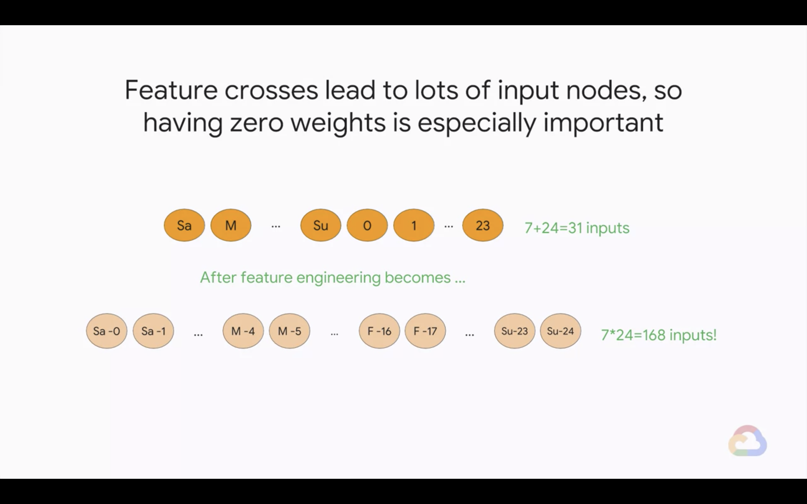
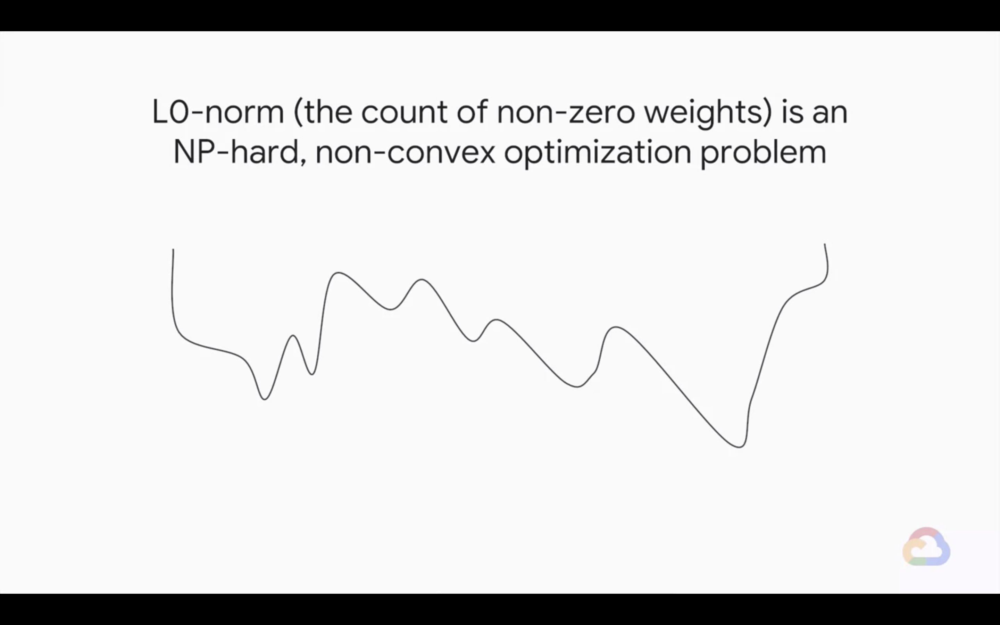
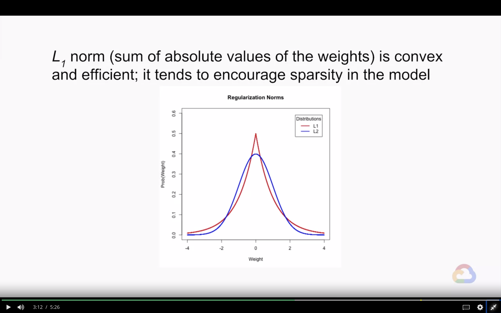
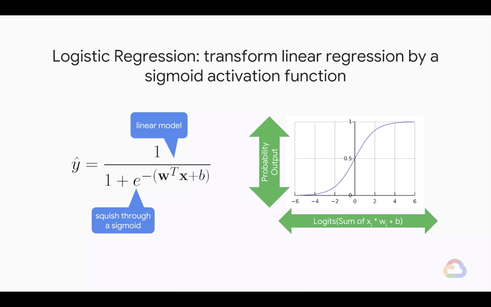
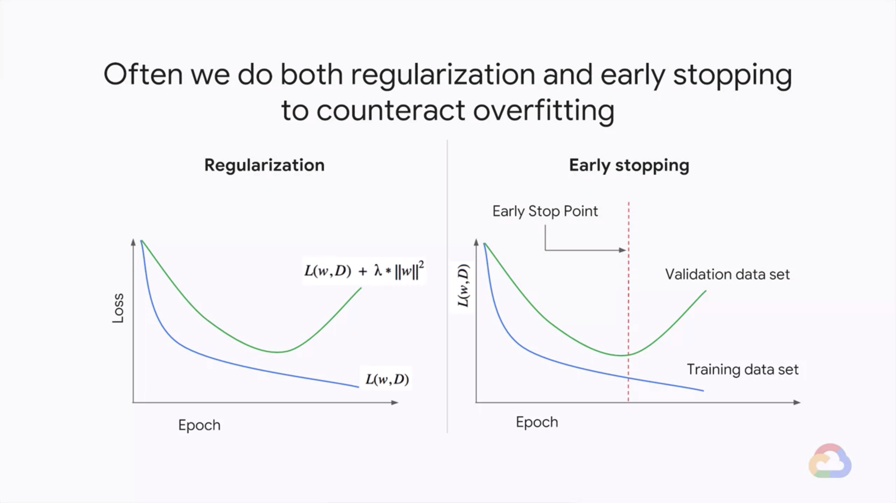

# A Pinch of Science

In this module, we will start to introduce the science along with the art of machine learning. We’re first going to talk about how to perform regularization for sparsity so that we can have simpler, more concise models. Then we’re going to talk about logistic regression and learning how to determine performance.

## Introduction

> 

---
## Regularization for Sparsity

> 

* Zeroing out coefficients can help with performance, especially with large models and sparse inputs
    | Actions | Impact |
    |---|---|
    | Fewer coefficients to store/load | Reduce memory, model size |
    | Fewer multiplications needed | Increase prediction speed |
    $$
    L(w, D) + \lambda \sum^{n}{|w|}
    $$
    * L2 regularization only makes weights **small**, not zero
* Feature crosses lead to lots of input nodes, so having zero weights is especially important
    
* **L0 norm** (the count of non-zero weights) is an NP-hard, non-convex optimization problem
    
* **L1 norm** (sum of absolute values of the weights) is convex and efficient; it tends to encourage sparsity in the model
    
* There are many possible choices of norms
    $$
    \| x \|_p = \left( \sum_{i = 1}^n{|x_i|^p} \right)^{1/p}
    $$
    * L0 norm
        $$
        \| x \|_0 = \sum_{i = 1}^n{|x_i|}^0
        $$
    * L1 norm - smaller model but less predictive
        $$
        \| x \|_1 = \sum_{i = 1}^n{|x_1|}
        $$
    * L2 norm - 
        $$
        \| x \|_2 = \left( \sum_{i = 1}^n{|x_i|} \right)^{1/2}
        $$
    * L$\infty$ norm
        $$
        \| x \|_{\infty} = \max {\{ |x_1|, ..., |x_n| \}}
        $$
* Elastic nets combine the feature selection of L1 regularization with the generalizability of L2 regularization
    

### Quiz - L1 Regularization

* What does L1 regularization tend to do a model's low predictive features' parameter weights?
    * A. Have small magnitudes
    * B. Have all positive values
    * C. Have zero values
    * D. Have large magnitudes
    > Answer: C.
* L1 regularization has been shown to induce sparsity to the model and do to its probably distribution, having a high peak at zero
* L2 regularization will be used for having small magnitudes

---
## Lab 4: L1 Regularization

> 
> 

* Please follow the details in [here](./Lab-4.md)

---
## Module Quiz

1. Which type of regularization is more likely to lead to zero weights?
    * A. L1
    * B. L2
    > Answer: A.
2. Which type of regularization penalizes large weight values more?
    * A. L1
    * B. L2
    > Answer: B.

---
## Logistic Regression

> 

* Case Study
    * Suppose you use linear regression to predict coin flips
        * You might use features like angle of bend, coin mass, etc. What could go wrong?
    * **Logistic Regression**: transform linear regression by a sigmoid activation function
        * The input into the sigmoid, normally the output of linear regression, is called the **logit**
        * Notice how the probability asymptotes to zero when the logits go to negative infinity and to one when the logits go to positive infinity
            
            * Unlike mean squared error, the sigmoid never guesses 1.0 to 0.0 probability
    * The output of Logistic Regression is a **calibrated probability estimate**
        
        * Useful because we can cast binary classification problems into probabilistic problems:
            * Will customer buy them? $\leftarrow$ Predict the probability that customer buys item
        * We can think of calibration as the fact the output activation functions an infinite number    
    * Typically, use cross-entropy (related to Shannon's information theory) as the error metric
        $$
        \textrm(LogLoss) = \sum_{(x,y) \in D}{-y\log{(\hat{y})}-(1-y)\log{(1 - \hat{y})}}
        $$
        * Less emphasis on errors where the output is relatively close to the label
    * Regularization is important in logistic regression because driving the loss to zero is difficult and dangerous
        
* Often we do both regularization and early stopping to counteract overfitting
    
    * Early stopping is an approximate equivalent of L2 regularization
    * Early stopping is often used in its place because it is competitionally cheaper
* In many real-world problems, the probability is not enough; we need to make a binary decision
    * Examples
        * Send the mail to spam folder or not?
        * Approve the loan or not?
        * Which road should we route the user through?
    * Choice of threshold is important and can be tuned
* Use the ROC curve to choose the decision threshold based on decision criteria
    
* The Area-Under-Curve (AUC) provides an aggregate measure of performance across all possible classification thresholds
    * AUC helps you choose between models when you don't know what decision threshold is going to be ultimately used
    * "If we pick a random positives and a random negative, what's the probability my model scores them in the correct relative order?"
* Logistic Regression predictions should be unbiased
    * **Average of predictions == Average of observations**
    * Look for bias in slices of data, this can guide improvements
    * Example
        * Use calubration plots of bucketed bias to find slices where your model performs poorly

### Quiz - Logistic Regression Regularization

* Why is it important to add regularization to logistic regression?
    * A. Helps stops weights being driven to +/- infinity
    * B. Helps logits stay away from asymptotes which can halt training
    * C. Transforms outputs into a calibrated probability estimate
    * D. Both A & B
    * E. Both A & C
    > Answer: D.

### Quiz - Logistic Regression

* Which of these is important when performing logistic regression?
    * A. Adding regularization
    * B. Choosing a tuned threshold
    * C. Checking for bias
    * D. All of the above
    > Answer: D.

---
## Module Quiz

1. You are training your classification model and are using Logistic Regression. Which is true?
    * A. Adding lots of new features will prevent the model from overfitting
    * B. Your last layer has no weights that can be tuned
    * C. Adding regularization will result in the same or better model performance
    > Answer: B.
