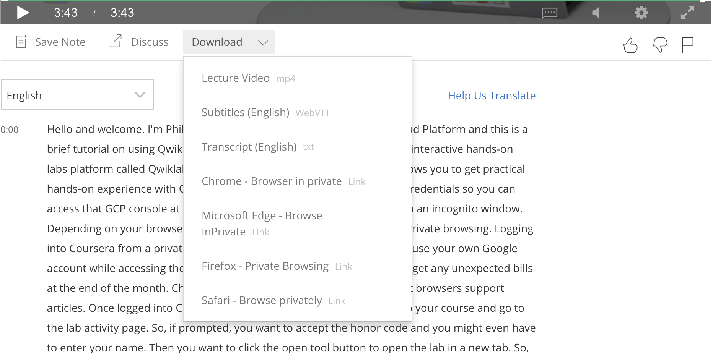

# Introducing Google Cloud Platform

Google Cloud Platform offers four main kinds of services: Compute, Storage, Big Data, and Machine Learning. This course focuses mostly on the first two, together with Google Virtual Private Cloud (VPC) networking. This module orients learners to the basics of Google Cloud Platform. It traces the evolution of cloud computing and explains what is unique about Google's approach to it. The module introduces the key structural concepts of regions and zones.

### Key Concepts

* Explain the advantages of Google Cloud Platform.
* Define the components of Google's network infrastructure, including: Points of presence, data centers, regions, and zones.
* Compare Infrastructure-as-a-Service (IaaS) and Platform-as-a-Service (PaaS).

---
## What's New in this Version?

### Reading: Welcome to Google Cloud Platform Fundamentals: Core Infrastructure

#### Who should take this course?

This course is aimed at IT professionals who are tasked with building and managing solutions in the cloud. If you are a system administrator, system operator, cloud solution architect, or software developer (or want to become one), this course is a great place for you to start.

If you are a data analyst, data engineer, or data scientist (or want to become one), consider starting instead with [Google Cloud Platform Big Data and Machine Learning Fundamentals](https://www.coursera.org/learn/gcp-big-data-ml-fundamentals).

#### Prerequisites

To succeed in this course, you should be familiar with IT concepts such as operating systems and networks. It also helps to be familiar with the Linux command line, web servers, and text editors. If you do not have these skills, consider starting with the [Google IT Support Professional](https://www.coursera.org/professional-certificates/google-it-support) certificate program available through Coursera.

The hands-on lab activities embedded in the course require the use of a desktop or laptop computer, a recent web browser, and an Internet connection. Auditing the course can be completed with a mobile device, but auditors do not earn a course completion certificate.

#### How this course teaches real-world skills

In addition to lectures and quizzes, this course contains hands-on labs in which you perform real-world tasks directly on Google Cloud Platform. Because these hands-on labs are provided to you through Google Cloud's Qwiklabs platform, there is no need for you to provide separate credentials or to incur Google Cloud Platform billing charges. Coursera will log you directly into Qwiklabs when you are ready to do a lab.

This course can be a part of your preparation for a job as a cloud solution architect, a cloud system administrator or operator, a cloud DevOps specialist, or a back-end software developer. Google Cloud Platform offers [professional certifications](https://cloud.google.com/certification/) to let you show the world that you can design, develop, manage and administer application infrastructure and data solutions on Google Cloud technology.

### What's new?

> 

### Reading: How to download course resources?

We encourage you to check out the downloadable resources for videos. Some of our videos reference external links or files that are available in the Resources section. On video player pages, Coursera has moved Video Resource files and links to the Download dropdown menu alongside video, caption, and transcript downloads. See the screenshot below for an example of the new Download menu.

