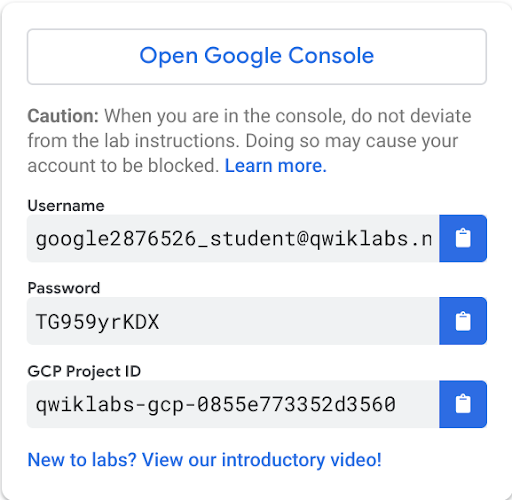
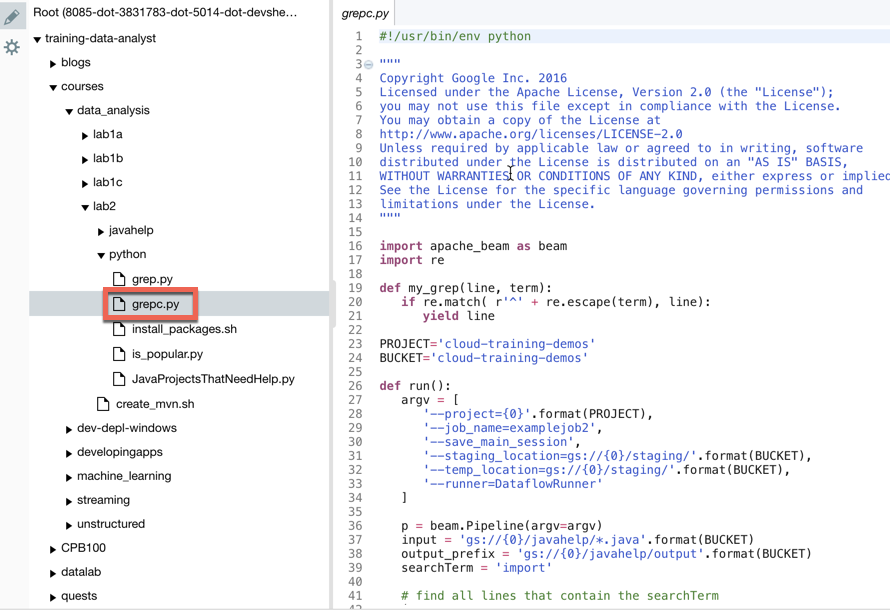

# Lab 2: Simple Dataflow Pipeline

> * Last Tested Date: DEC 05, 2018
> * Last Updated Date: DEC 05, 2018

## Overview

In this lab, you learn how to write a simple Dataflow pipeline and run it both locally and on the cloud.

### What You Learn

In this lab, you learn how to:

* Write a simple pipeline in Python
* Execute the query on the local machine
* Execute the query on the cloud

---
## Setup

For each lab, you get a new GCP project and set of resources for a fixed time at no cost.
1. Make sure you signed into Qwiklabs using an incognito window.
2. Note the lab's access time (for example, `02:00:00` and make sure you can finish in that time block.
    * There is no pause feature. You can restart if needed, but you have to start at the beginning.
3. When ready, click `START LAB`
4. Note your lab credentials. You will use them to sign in to Cloud Platform Console. 
    
5. Click `Open Google Console`.
6. Click `Use another account` and copy/paste credentials for **this** lab into the prompts.
    * If you use other credentials, you'll get errors or **incur charges**.
7. Accept the terms and skip the recovery resource page.
    * Do not click `End Lab` unless you are finished with the lab or want to restart it. This clears your work and removes the project.

---
## Open Dataflow Project

1. Start **Cloud Shell** and clone the source repo which has starter scripts for this lab:
    ```bash
    $ git clone https://github.com/GoogleCloudPlatform/training-data-analyst
    ```
    * Then navigate to the code for this lab:
        ```bash
        $ cd training-data-analyst/courses/data_analysis/lab2/python
        ```
2. Install the necessary dependencies for Python dataflow:
    ```bash
    $ sudo ./install_packages.sh
    ```
    * Verify that you have the right version of `pip` (should be > 8.0):
        ```bash
        $ pip -V
        ```
    * If not, open a new **Cloud Shell** tab and it should pick up the updated `pip`.

---
## Pipeline Filtering

1. View the source code for the pipeline using the **Cloud Shell** file browser:
    
    * In the file directory, navigate to `/training-data-analyst/courses/data_analysis/lab2/python`.
        
    * Find `grep.py`.
        
    * Or you can navigate to the directly and view the file using `nano` if you prefer:
        ```bash
        $ nano grep.py
        ```
2. Answer the following questions
    * What files are being read? 
        * `'../javahelp/src/main/java/com/google/cloud/training/dataanalyst/javahelp/*.java'`
    * What is the search term?
        * `'import'`
    * Where does the output go?
        * `'/tmp/output'`
    * There are three transforms in the pipeline:
        1. What does the transform do?
        2. What does the second transform do? ______________________________
           * Where does its input come from? ________________________
           * What does it do with this input? __________________________
           * What does it write to its output? __________________________
           * Where does the output go to? ____________________________
        3. What does the third transform do? _____________________

---
## Execute the Pipeline Locally

1. Execute locally:
    ```bash
    $ python grep.py
    ```
    * **s** if you see an error that says `"No handlers could be found for logger "oauth2client.contrib.multistore_file"`, you may ignore it. The error is simply saying that logging from the oauth2 library will go to stderr.
2. Examine the output file:
    ```bash
    $ cat /tmp/output-*
    ```
    * Does the output seem logical? ______________________

---
## Execute the Pipeline on the Cloud

1. If you don't already have a bucket on Cloud Storage, create one from the [Storage section of the GCP console](http://console.cloud.google.com/storage). Bucket names have to be globally unique.
2. Copy some Java files to the cloud (make sure to replace `<YOUR-BUCKET-NAME>` with the bucket name you created in the previous step):
    ```bash
    $ gsutil cp ../javahelp/src/main/java/com/google/cloud/training/dataanalyst/javahelp/*.java gs://<YOUR-BUCKET-NAME>/javahelp
    ```
3. Edit the Dataflow pipeline in `grepc.py` by opening up in the **Cloud Shell** in-browser editor again or by using the command line with nano:
    
    ```bash
    $ nano grepc.py
    ```
    * and changing the `PROJECT` and `BUCKET` variables appropriately.
4. Submit the Dataflow to the cloud:
    ```bash
    $ python grepc.py
    ```
    * Because this is such a small job, running on the cloud will take significantly longer than running it locally (on the order of 2-3 minutes).
5. On your [Cloud Console](https://console.cloud.google.com/), navigate to the **Dataflow** section (from the 3 bars on the top-left menu), and look at the Jobs. Select your job and monitor its progress. You will see something like this:
    
6. Wait for the job status to turn to **Succeeded**. At this point, your CloudShell will display a command-line prompt. In CloudShell, examine the output:
    ```bash
    $ gsutil cat gs://<YOUR-BUCKET-NAME>/javahelp/output-*
    ```

---
## What You Learned

In this lab, you:

* Executed a Dataflow pipeline locally
* Executed a Dataflow pipeline on the cloud.
  
---
## End Your Lab

1. When you have completed your lab, click `End Lab`. Qwiklabs removes the resources you’ve used and cleans the account for you.
2. You will be given an opportunity to rate the lab experience. Select the applicable number of stars, type a comment, and then click `Submit`.
    * The number of stars indicates the following:
        * 1 star = Very dissatisfied
        * 2 stars = Dissatisfied
        * 3 stars = Neutral
        * 4 stars = Satisfied
        * 5 stars = Very satisfied
3. You can close the dialog box if you don't want to provide feedback.
4. For feedback, suggestions, or corrections, please use the `Support` tab.

---
> ©2019 Google LLC All rights reserved. Google and the Google logo are trademarks of Google LLC. All other company and product names may be trademarks of the respective companies with which they are associated.