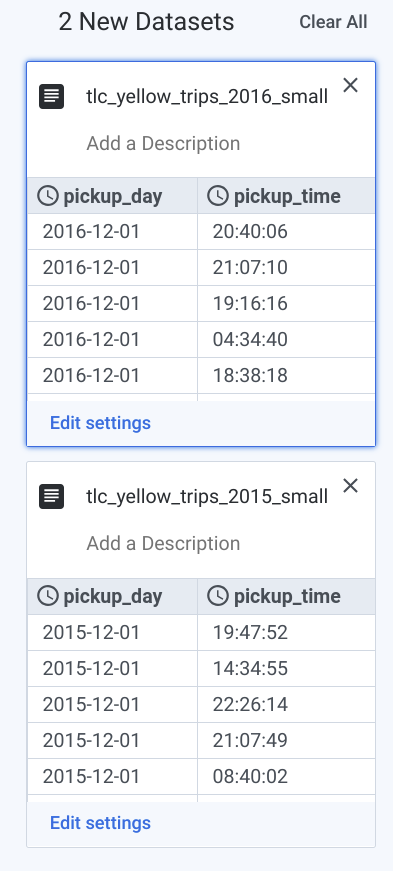
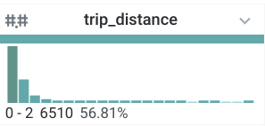
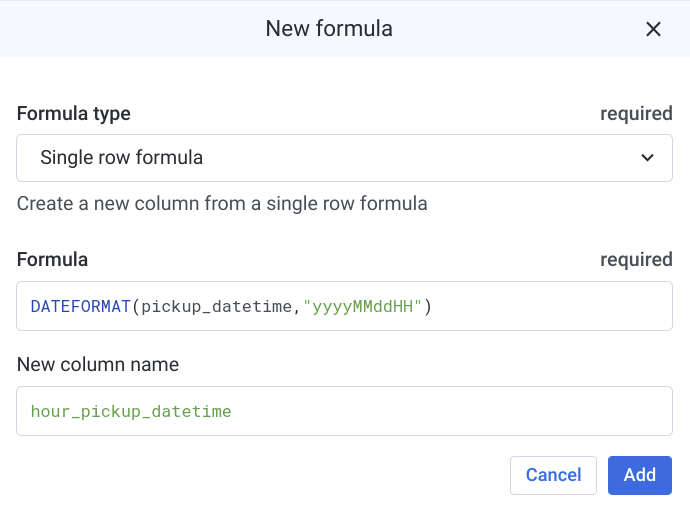
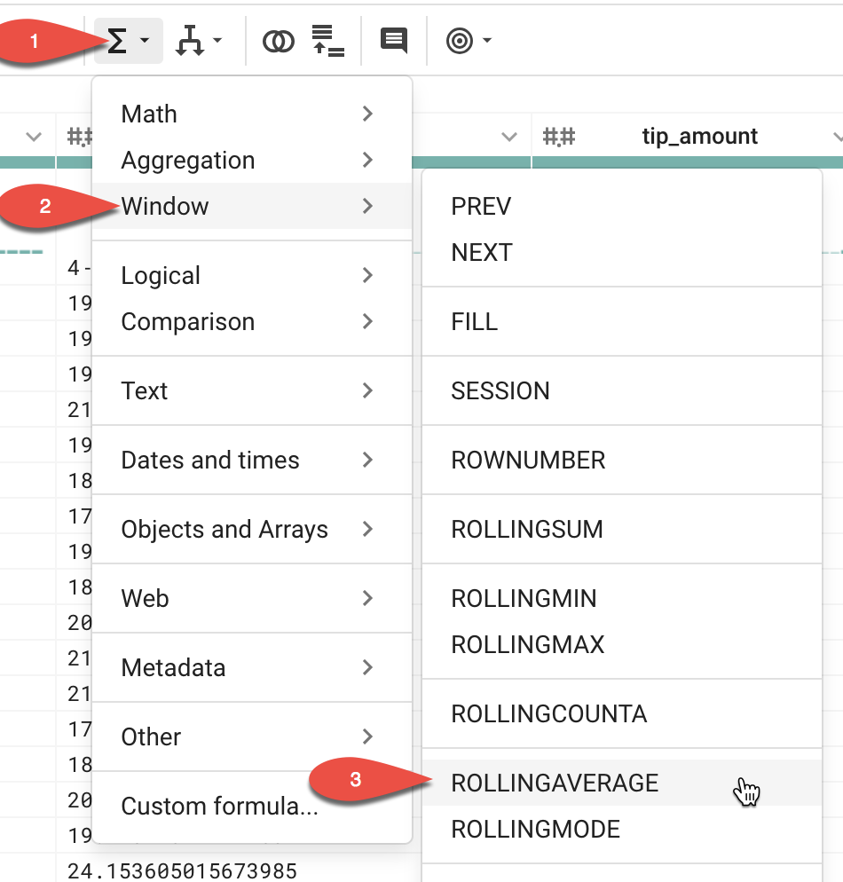
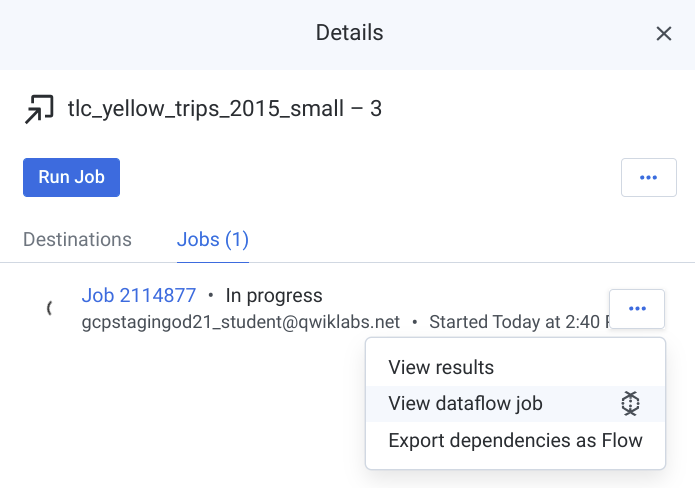

# Lab 4: Computing Time-windowed Features in Cloud Dataprep

> * Last Tested Date: DEC 05, 2018
> * Last Updated Date: DEC 05, 2018

## Overview

In this lab, you will ingest, transform, and analyze a taxi cab dataset using Google Cloud Dataprep. We will calculate key reporting metrics like the average number of passengers picked up in the past hour.

### What You Learn

In this lab, you:

* Build a new Flow using Cloud Dataprep
* Create and chain transformation steps with recipes
* Running Cloud Dataprep jobs (Dataflow behind-the-scenes)

Cloud Dataprep is Google's self-service data preparation tool. In this lab, you will learn how to clean and enrich multiple datasets using Cloud Dataprep.

---
## Setup

For each lab, you get a new GCP project and set of resources for a fixed time at no cost.
1. Make sure you signed into Qwiklabs using an incognito window.
2. Note the lab's access time (for example, `02:00:00` and make sure you can finish in that time block.
    * There is no pause feature. You can restart if needed, but you have to start at the beginning.
3. When ready, click `START LAB`
4. Note your lab credentials. You will use them to sign in to Cloud Platform Console. 
    
5. Click `Open Google Console`.
6. Click `Use another account` and copy/paste credentials for **this** lab into the prompts.
    * If you use other credentials, you'll get errors or **incur charges**.
7. Accept the terms and skip the recovery resource page.
    * Do not click `End Lab` unless you are finished with the lab or want to restart it. This clears your work and removes the project.

---
## Create a New Storage Bucket

> **Hint:** Skip this section if you already have a GCS Bucket

1. Open the **Google Cloud Console** at [console.cloud.google.com](http://console.cloud.google.com/).
2. Go to Storage in the **Navigation menu** (left-side navigation).
3. Click `Create Bucket` (or use an existing bucket).
4. In the Create a bucket window that will appear, add a unique bucket name and leave the remaining settings at their default values.
5. Click `Create`.
6. You now have a Cloud Storage Bucket which we will be using to store raw data for ingestion into Google BigQuery later and for storing Cloud Dataprep settings.

---
## Create BigQuery Dataset to Store Cloud Dataprep Output

1. Open BigQuery at https://console.cloud.google.com/bigquery.
2. In the left side bar, **click on your project name**.
3. Click `CREATE DATASET`.
4. For Dataset ID, type `taxi_cab_reporting` and select `Create dataset`.
    * Now you have a new empty dataset that we can populate with tables.

---
## Launcg Cloud Dataprep

1. Open the **Navigation menu**.
2. Under Big Data, click on `Dataprep`.
3. **Agree** to the Terms of Service.
4. Click `Agree and Continue`.
    
    * Click `Allow` for Trifacta to access project data. Dataprep is provided in collaboration with Trifacta, a Google partner.
        
5. Ckick `Allow`.
    
6. When prompted for "First Time Setup", click `Continue`.
7. Wait for Cloud Dataprep to initialize (less than a minute typically).

---
## Import NYC Taxi Data from GCS into a Dataprep Flow

1. In the Cloud Dataprep UI, click `Create Flow`.
2. Specify the following **Flow details**:
    * **Flow Name**
    * Click `Create`.
    * If prompted, dismiss the helper tutorial.
3. Click `Import & Add Datasets`.
4. In the data importer left side menu, click `GCS (Google Cloud Storage)`.
5. Click the `Pencil Icon` to edit the GCS path.
6. Paste in the 2015 taxi rides dataset CSV from Google Cloud Storage:
    ```bash
    gs://cloud-training/gcpml/c4/tlc_yellow_trips_2015_small.csv
    ```
    * Click `Go`.
7. Before selecting Import, click the `Pencil Icon` to **edit the GCS path** a second time and paste in the 2016 CSV below:
    ```bash
    gs://cloud-training/gcpml/c4/tlc_yellow_trips_2016_small.csv
    ```
    * Click `Go`.
8. Click `Import & Add to Flow`.
    
9. **Wait** for the datasets to be loaded into DataPrep.
    * The tool loads up to a 10MB sample of the underlying data as well as connects to and ingests the original data source when the flow is ran.
10. Click on the `tlc_yellow_trips_2015_small` icon and select `Add New Recipe`.
11. Click `Edit Recipe`.
    * Wait for Dataprep to load your data sample into the explorer view
12. In the explorer view, find the `trip_distance` column and examine the histogram.
    * Quiz: True or False, the majority of the cab rides for 2015 were less than 2 miles?
        
        > Answer: True. In our sample, around 57% were between 0 to 2 miles.
    * Now, let's combine our 2016 and 2015 datasets.
13. In the navigation bar, find the icon for `Union` and select it.
    
14. In the Union Page, click `Add data`.
    * In the popup window, select `tlc_yellow_trips_2016_small` and click `Apply`.
15. Confirm the union looks like below `(UNION DATA (2))` and then click `Add to Recipe`.
    
    * Wait for Dataprep to Apply the Union.
    * Now we have a single table with 2016 and 2015 taxicab data.

### Exploring your Data

16. Examination
    * Examine the `pickup_time` histogram. Which hours had the fewest amount of pickups? The most?
        * In our sample, the early morning hours (5 - 6am) had the **fewest** taxicab pickups.
            
        * The most taxi cab pickups were in the evening hours with 19:00 (7pm) having slightly more than others.
            
    * Is this unusual? Would you expect NYC taxi cab trips to be clustered around lunch and earlier hours in the day? Let's continue exploring.
    * Examine the `pickup_day` histogram. Which months and years of data do we have in our dataset?
        * Only December 2015 and December 2016
            
    * Examine the `dropoff_day` histogram. Is there anything unusual about it when compared to `pickup_day`? Why are there records for January 2017?
        
        > Answer: There are a few trips that start in December and end in January (spending New Years in a taxicab!).
    * Next, we want to concatenate our date and time fields into a single timestamp.
17. In the navigation bar, find **Merge columns**.
    
    * For columns to merge, specify `pickup_day` and `pickup_time`.
    * For separator **type a single space**.
    * Name the new column `pickup_datetime`.
    * Preview and click `Add`.
        
    * Confirm your new field is properly registering now as a datetime datatype (clock icon).
        
18. Next, we want to **create a new derived column** to count the average amount of passengers in the last hour. To do that, we need to create to get hourly data and perform a calculation.
    * Find the `Functions` list in the navigation bar.
    * Select `Dates and times`.
    * Select `DATEFORMAT`.
        
    * In the formula, paste the following which will truncate the pickup time to just the hour:
        ```
        DATEFORMAT(pickup_datetime,"yyyyMMddHH")
        ```
        
    * Specify the New Column as `hour_pickup_datetime`.
    * Confirm the new derived column is shown correctly in the **preview**.
        
    * Click `Add`.
19. In order to get the field properly recognized as a `DATETIME` data type, we are going to add back zero minutes and zero seconds through a `MERGE` concatenation.
    * In the navigation bar, find **Merge columns**.
        
    * For columns to merge, specify `hour_pickup_datetime` and `'0000'`.
    * Name the column to `pickup_hour`.
        
    * Click `Add`.
        * We now have our taxicab hourly pickup column. Next, we will calculate the average count of passengers over the past hour. We will do this through aggregations and a rolling window average function.
20. In the navigation toolbar select `Functions > Aggregation > AVERAGE`.
    
    * For **Formula**, specify:
        ```
        AVERAGE(fare_amount)
        ```
    * For **Sort** rows, specify:
        ```
        pickup_datetime
        ```
    * For **Group by**, specify:
        ```
        pickup_hour
        ```
        
    * Click `Add`.
        * We now have our average cab fares statistic.
21. Explore the `average_fare_amount` histogram. Is there a range of fares that are most common?
    
    * In our sample, most NYC cab fares are in the \$12-13 range.
    * Next, we want to calculate a rolling window of average fares over the past 3 hours.
22. In the navigation toolbar, select `Functions > Window > ROLLINGAVERAGE`.
    
    * Copy in the below formula which computes the rolling average of passenger count for the last hour.
        * Formula:
            ```
            ROLLINGAVERAGE(average_fare_amount, 3, 0)
            ```
        * Sort rows by:
            ```
            -pickup_hour
            ```
    * Note that we are sorting recent taxicab rides first (the negative sign `-pickup_hour` indicates descending order) and operating over a rolling 3 hour period.
        
    * Click `Add`.
23. Toggle open the **Recipe icon** to preview your final transformation steps.
    
    
24. Click `Run Job`.
25. In **Publishing Actions page**, under Settings, edit the path by clicking the pencil icon
    
    * Choose `BigQuery` and choose your `taxi_cab_reporting` BigQuery dataset where you want to create the output table.
        * **Note:** if you do not see a `taxi_cab_reporting` dataset, refer to the start of this lab for instructions on how to create it in BigQuery)
    * Choose `Create a new table`.
    * Name the table `tlc_yellow_trips_reporting`.
    * Choose `Drop the table every run`.
    * Select `Update`.
26. Select `Run Job`.
27. (Optional) View the Cloud Dataflow Job by selecting `[...]` and `View dataflow job`.
    
    * Wait for your Cloud Dataflow job to complete and confirm your new new table shows in BigQuery.
28. While your Cloud Dataprep flow starts and manages your Cloud Dataflow job, you can see the data results by running this pre-ran query in BigQuery:
    ```sql
    #standardSQL
    SELECT
        pickup_hour,
        FORMAT("$%.2f",ROUND(average_3hr_rolling_fare,2)) AS avg_recent_fare,
        ROUND(average_trip_distance,2) AS average_trip_distance_miles,
        FORMAT("%'d",sum_passenger_count) AS total_passengers_by_hour
    FROM
        `asl-ml-immersion.demo.nyc_taxi_reporting`
    ORDER BY
        pickup_hour DESC;
    ```
    * Extra credit:
        * You can schedule Cloud Dataprep jobs to run at set intervals. Select a flow and click `[...]` and `Schedule Flow`.
        

Congratulations! You have now built a data transformation pipeline using the Cloud Dataprep UI.

For full documentation and additional tutorials, refer to the [Cloud Dataprep support page](https://cloud.google.com/dataprep/).

---
## End Your Lab

1. When you have completed your lab, click `End Lab`. Qwiklabs removes the resources you’ve used and cleans the account for you.
2. You will be given an opportunity to rate the lab experience. Select the applicable number of stars, type a comment, and then click `Submit`.
    * The number of stars indicates the following:
        * 1 star = Very dissatisfied
        * 2 stars = Dissatisfied
        * 3 stars = Neutral
        * 4 stars = Satisfied
        * 5 stars = Very satisfied
3. You can close the dialog box if you don't want to provide feedback.
4. For feedback, suggestions, or corrections, please use the `Support` tab.

---
> ©2019 Google LLC All rights reserved. Google and the Google logo are trademarks of Google LLC. All other company and product names may be trademarks of the respective companies with which they are associated.
