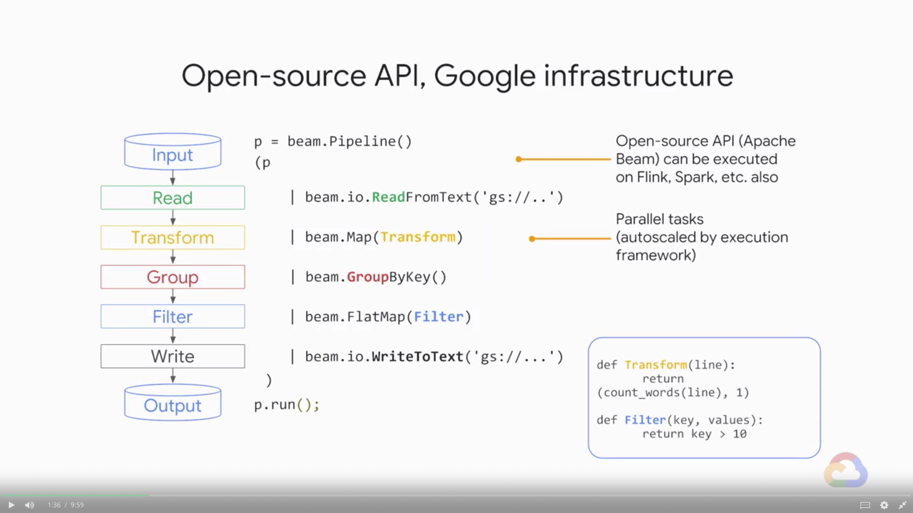
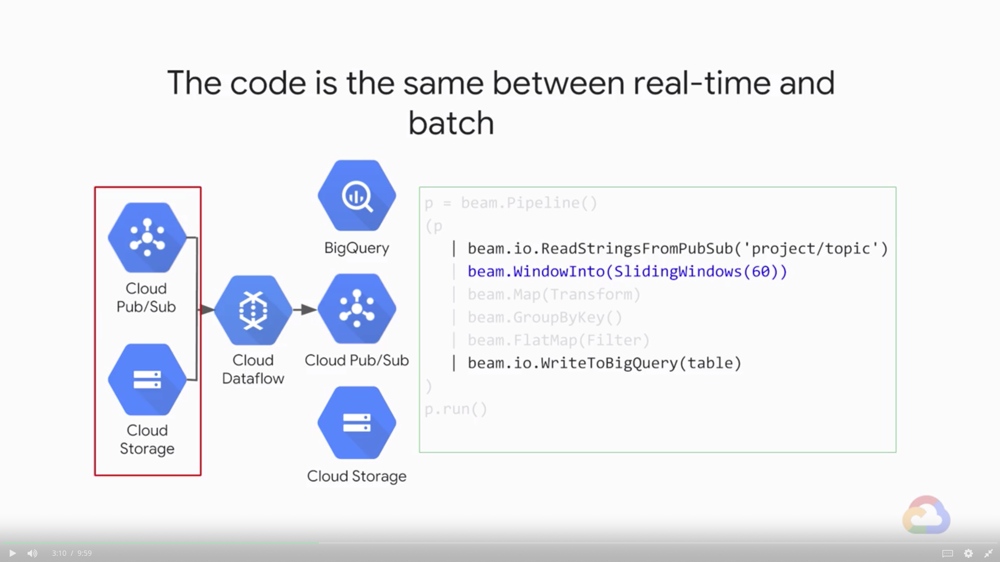
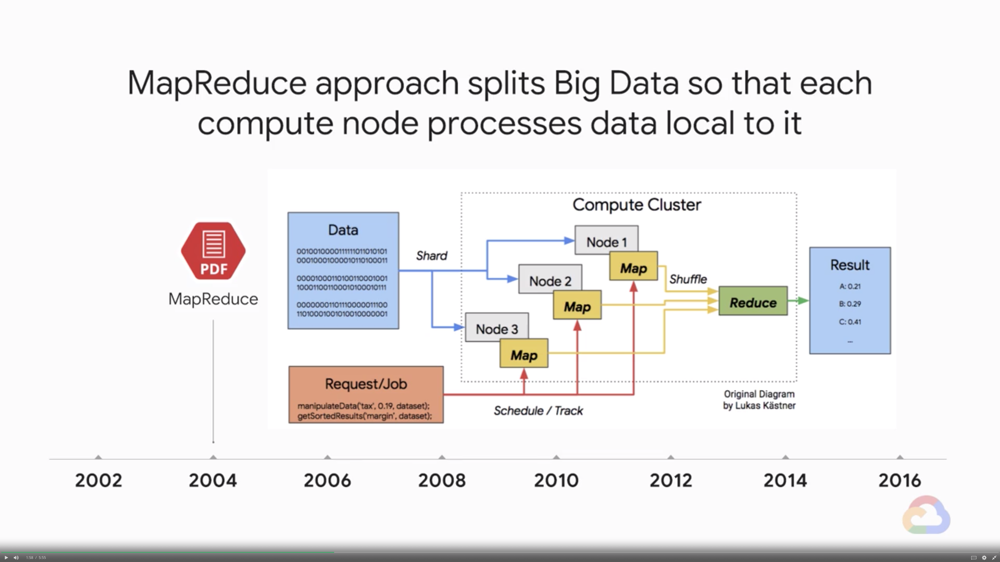
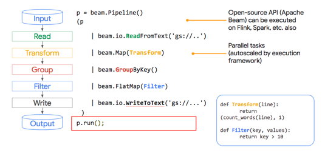
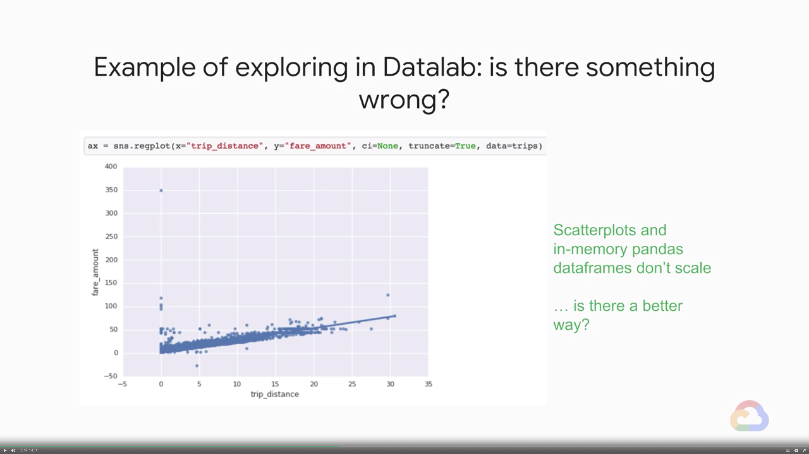
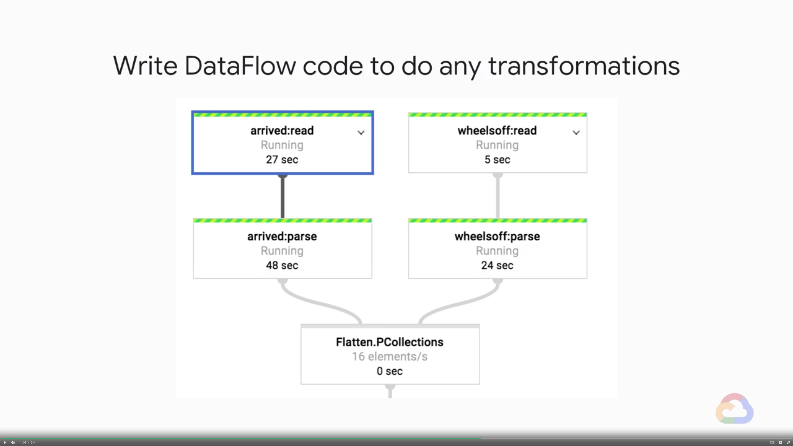

# Preprocessing and Feature Creation

This section of the module covers pre-processing and feature creation which are data processing techniques that can help you prepare a feature set for a machine learning system.

## Introduction

> [](https://youtu.be/H0maVBPKZ4g)

* Learn how to
    * Get started with preprocessing ad feature creation
    * Use Apache Beam and Cloud Dataflow for feature engineering
* Feature engineering often requires global statistics and vocabularies
    ```python
    features=['scaled_price'] = (features['prices'] - min_price) / (max_price - min_price)
    ```
    ```python
    tf.feature_column.categorical_with_vocabulary_list('city', keys=['San Diego', 'Los Angeles', 'San Francisco', 'Sacramento'])
    ```
    * How do you get full vocabulary of cities in the training dataset?
* Preprocess with
    * BigQuery
    * Apache Beam
    * TensorFlow
* Things that are commonly done in preprocessing
    * BigQuery
        * Remove examples that you don't want to train on
        * Compute vocabularies for categorical columns
        * Compute aggregate statistics for numeric columns
    * Apache Beam
        * Compute time-windowed statistics (e.g., number of products sold in previous hour) for use as input features
    * TensorFlow or Apache Beam
        * Scaling, discretization, etc. of numeric features
        * Splitting, lower-casing, etc. textual features
        * Resizing of input images
        * Normalizing volumn level of input audio
* Example of preprocessing in BigQuery
    ```sql
    SELECT
        (tolls_amount + fare_amount)
        AS fare_amount,
        DAYOFWEEK(pickup_datetime)
        AS dayofweek,
        HOUR(pickup_datetime)
        AS hourofday,
        ...
        FROM
            `nyc-tlc.yellow.trips`
        WHERE
            trip_distance > 0
    ```
* There are two places for feature creation in TensorFlow
    1. Features are preprocessed in `input_FN(train, eval, serving)`
        ```python
        features['capped_rooms'] = tf.clip_by_value(
            features['rooms'],
            clip_value_min=0,
            clip_value_max=4
        )
        ```
    2. Features columns are passed into estimator during construction
        ```python
        lat = tf.feature_column.numeric_column('latitude')
        dlat = tf.feature_column.bucketized_column(lat, boundaries=np.arange(32, 42, 1).tolist())
        ```
* Example of preprocessing in TensorFlow `input_FN`
    ```python
    def add_engineered(features):
        lat1 = features['pickuplat']
        ...
        dist = tf.sqrt(latdiff * latdiff + londiff * londiff)
        features['euclidean'] = dist
        return features
    ```
    * How do we make sure this function gets called during both training and prediction?
        * Wrap features by call to the feature engineering to function
            1. Wrap features in training/evaluation input function:
                ```python
                def input_fn():
                    features = ...
                    label = ...
                    return add_engineered(features), label
                ```
            2. Wrap features in serving input function also:
                ```python
                def serving_input_fn():
                    feature_placeholders = ...
                    features = ...
                    return tf.estimator.export.ServingInputReceiver(
                        add_engineered(features), feature_placeholders
                    )
                ```
* Example of preprocessing via feature column
    ```python
    def build_estimator(model_dir, nbuckets):
        latbuckets = np.linspace(38.0, 42.0, nbuckets).tolist()
        b_plat = tf.feature_column.bucketized_column(plat, latbuckets)
        b_dlat = tf.feature_column.bucketized_column(dlat, latbuckets)

        return tf.estimator.LinearRegressor(
            model_dir=model_dir,
            feature_columns=[..., b_plat, b_dlat, ...]
        )
    ```
* Example of preprocessing in Apache Beam
    * The same code can be used during both training and serving of a model
    ```python
    def to_csv(rowdict):
        if distance(rowdict['pickuplon'], ...) > 10:    # Only rides of more than 10km
            CSV_COLUMNS = 'fare_amount,dayofweek,...,key'.split(',')
            yield ','.join([str(rowdict[k]) for k in CSV_COLUMNS])
    
    def preprocess():
        ...
        for n, step in enumerate(['train', 'valid']):
            (p | 'read_{}'.format(step) >> beam.io.Read(beam.io.BigQuerySoruce(query=query))
            | 'tocsv_{}'.format(step) >> beam.FlatMap(to_csv)
            | 'write_{}'.format(step) >> beam.io.Write(beam.io.WriteToText(outfile)))
        p.run()
    ```

### Module Quiz

1. You are training a model to predict how long it will take to sell a house. The list price of the house, with numeric \$20,000 to \$500,000 values, is one of the inputs to the model. Which of these is a good practice?
    * A. Rescale the real valued feature like a price to a range from 0 to 1
    * B. Rescale the real valued feature like a price to a range from 0 to \$100,000
    * C. Rescale the real valued feature like a price to a categorical range from low, medium, high
    > Answer: A.
2. Which of these tools are commonly used for data pre-processing? (Select 3 correct responses)
    * A. Google Cloud Storage
    * B. Bigtable
    * C. Apache Beam
    * D. BigQuery
    * E. TensorFlow
    > Answer: C. D. E.
3. Which one of these is NOT something you would commonly do in data preprocessing?
    * A. Compute aggregate statistics for numeric columns
    * B. Compute time-windowed statistics (e.g. number of products sold in previous hour) for use as input features
    * C. Tune your ML model hyperparameters
    * D. Compute vocabularies for categorical columns
    * E. Remove examples that you don’t want to train on
    > Answer: C.
4. In your TensorFlow model you are calculating the distance between two points on a map as a new feature. How do you ensure the preprocessing you're doing for model training is also do the exact same way in prediction?
    
    * A. Wrap features in training/evaluation input function:
    * B. Wrap features in serving input function:
    * C. Wrap features in training/evaluation input function AND wrap features in serving input function:
    > Answer: C.
5. The below code preprocesses the latitude and longitude using feature columns. What is the point of the 38.0 and 42.0 in the column buckets?
    
    * A. These define how many samples to put into each bucket (at least 38 but no more than 42 in each small bucket)
    * B. Latitudes must be between 38 and 42 will be discretized into the specified number of bins.
    * C. These parameters ensure all latitudes in the raw dataset do not include 38 and 42 which we want to exclude for this dataset.
    > Answer: B.
6. What are two advantages of using TensorFlow to preprocess your code instead of building an Apache Beam pipeline? (Select two correct responses)
    * A. In TensorFlow the Apache Beam pipeline code is automatically generated for you
    * B. In TensorFlow the same pipelines can be used in both training and serving
    * C. In TensorFlow you will have access to helper APIs to help automatically bucketize and process features instead of writing your own java or python code
    > Answer: B. C.
7. What is one key advantage of preprocessing your features using Apache Beam?
    * A. Apache Beam transformations are written in Standard SQL which is scalable and easy to author
    * B. The same code you use to preprocess features in training and evaluation can also be used in serving
    * C. Apache Beam code is often harder to maintain and run at scale than BigQuery preprocessing pipelines
    > Answer: B.

---
## Apache Beam and Cloud Dataflow

> [](https://youtu.be/tJiV2-C_Zbs)

* Apache Beam is a way to write elastic data processing pipelines
    
* Cloud Dataflow allows user to run these kinds of data processing pipelines
    * Dataflow can run pipelines written in Python and Java programming languages
    * Dataflow sets itself apart as a platform for data transformation
    * Dataflow can change the amount of computer resources, the number of servers that will run your pipeline, and do that elastically
* Open-source API, Google Infrastructure
    
* The code is the same between real-time and batch
    
* Dataflow terms and concepts
    
* A pipeline is a directed graph of steps
    * E.g., Read in data, transform it, write out
    * Can branch, merge, use if-then statements, etc.
    * Python syntax
        ```python
        import apache_beam as beam
        if __name__ == '__main__':
            # Create a pipeline parameterized by commandline flags
            p = beam.Pipeline(argv=sys.argv)
            (p
                | 'Read' >> beam.io.ReadFromText('gs://...')    # Read input
                | 'Countwords' >> beam.FlatMap(lambda line: count_words(line))
                | 'Write' >> beam.io.WriteToText('gs://...')    # Write output
            )
            # Run the pipeline
            p.run()
        ```
* Every time you use the pipe operator, you provide a PCollection data structure as input and return PCollection as output
    * PCollections does not store all of its data in memory
    * PCollections is like a data structure with pointers to where the data flow cluster stores your data
        ```java
        import org.apache.beam.sdk.Pipeline;
        public static void main(String[] args) {
            // Create a pipeline parameterized by commandline flags
            Pipeline p = Pipeline.create(PipelineOptionFactory.fromArgs(args));
            p.apply(TextIO.read().from("gs://..."))     // Read input
                .apply(new CountWords())                // Do some processing
                .apply(TextIO().write().to("gs://...")) // Write output
            // Run the pipeline
            p.run();
        }
        ```
* Apply Transform to PCollection (Python)
    * Data in a pipeline are represented by PCollection
        * Supports parallel processing
        * Not an in-memory collection; can be unbounded
            ```python
            lines = p | ...
            ```
        * Apply Transform to PCollection; return PCollection
            ```python
            sizes = lines | 'length' >> beam.Map(lambda line: len(line))
            ```
* Ingesting data into a pipeline (Python)
    * Read data from file system, GCS or BigQuery
        * Text formats return String
            ```python
            lines = beam.io.ReadFromText('gs://.../input-*.csv.gz')
            ```
        * BigQuery returns a TableRow
            ```python
            rows = beam.io.Read(beam.io.BigQuerySource(query='SELECT x, y, z' \ 
            'FROM [project:dataset.tablename]', project='PROJECT'))
            ```
* Can write data out to some formats (Python)
    * Write data to file system, GCS or BigQuery
        ```python
        beam.io.WriteToText(file_path_prefix='/data/output/', file_name_suffix='.txt')
        ```
    * Can prevent sharding of output (do only if it is small)
        ```python
        beam.io.WriteToText(file_path_prefix='/data/output/', file_name_suffix='.txt', num_shards=1)
        ```
        * The output must be a PCollection of Strings before writing out
* Executing pipeline (Python)
    * Simply running `main()` runs pipeline locally
        ```bash
        $ python ./grep.py
        ```
    * To run on cloud, specify cloud parameters, and submit the job to Dataflow
        ```bash
        $ python ./grep.py \
            --project=$PROJECT \
            --job_name=myjob \
            --staging_location=gs://$BUCKET/staging/ \
            --temp_location=gs://$BUCKET/staging/ \
            --runner=DataflowRunner
        ```

### Data Pipelines that Scale

> [](https://youtu.be/sFAZDhCsVmg)

* MapReduce approach splits Big Data so that each compute node processes data local to it
    
* ParDo allows for parallel processing
    * ParDo acts on one item at a time (like a Map in MapReduce)
        * Multiple instances of class on many machines
        * Should not contain any state
    * Useful for:
        * Filtering (choosing which inputs to emit)
        * Extracting parts of an input (e.g., fields of TableRow)
        * Converting one Java type to another
        * Calculating values from different parts of inputs
* Python: Map vs. FlatMap
    * Use Map for 1:1 relationship between input and output
        ```python
        'WordLength' >> beam.Map(lambda word: (word, len(word)))
        ```
    * FlatMap for non 1:1 relationships, usually with generator
        ```python
        def vowels(word):
            for ch in word:
                if ch in ['a', 'e', 'i', 'o', 'u']:
                    yield ch
        'WordVowels' >> beam.FlatMap(lambda word: vowels(word))
        ```
        * Java: Use `apply(ParDo)` for both cases
    * Unlike Map, `beam.FlatMap` supports transformations that can gernerate any number of outputs for an input including zero outputs
        * The transformations in `beam.FlatMap` can also be run in parallel by Dataflow
* `GroupBy` operation is akin to shuffle
    * In Dataflow, shuffle explicitly with a `GroupByKey`
        * Create a Key-Value pair in a ParDo
        * Then group by the key
        ```python
        cityAndZipcodes = p
        | beam.Map(lambda address: (address[1], address[3]))
        | beam.GroupByKay()
        ```
* `Combine.PerKey` is similar to the shuffle step in MapReduce, which lets you aggregate
    * Can be applied to a PCollection of values:
        ```python
        totalAmount = salesAmount | Combine.globally(sum)
        ```
    * And also to a grouped Key-Value pair:
        ```python
        totalSalesPerPerson = salesRecords | Combine.perKey(sum)
        ```
    * Many built-in functions: `Sum`, `Mean`, etc.

### Module Quiz

1. Which of these accurately describes the relationship between Apache Beam and Cloud Dataflow?
    * A. Apache Beam is the API for data pipeline building in java or python and Cloud Dataflow is the implementation and execution framework.
    * B. Cloud Dataflow is the proprietary version of the Apache Beam API and the two are not compatible
    * C. Cloud Dataflow is the API for data pipeline building in java or python and Apache Beam is the implementation and execution framework.
    * D. They are the same
    > Answer: A.
2. TRUE or FALSE: The Filter method can be carried out in parallel and autoscaled by the execution framework:
    
    * True
    * False
    > Answer: True.
3. What is the purpose of a Cloud Dataflow connector?
    ```java
    .apply(TextIO.write().to(“gs://…”));
    ```
    * A. Connectors allow you to chain multiple data-processing steps together automatically so they process in parallel
    * B. Connectors allow you to output the results of a pipeline to a specific data sink like Bigtable, Google Cloud Storage, flat file, BigQuery, and more...
    * C. Connectors allow you to authenticate your pipeline as specific users who may have greater access to datasets
    > Answer: B.
4. Below you'll find a Cloud Dataflow preprocessing graph. Correctly identify the terms for A, B, and C.
    
    * A. A is a data stream, B are transformation steps, and C is a data source
    * B. A is a data source, B are transformation steps, and C is a data sink
    * C. A is a data stream, B are transformation steps, and C is a data sink
    > Answer: B.
5. To run a pipeline you need something called a ________
    * A. runner
    * B. pipeline
    * C. executor
    * D. Apache Beam
    > Answer: A.
6. Your development team is about to execute this code block. What is your team about to do?
    
   * A. We are compiling our Cloud Dataflow pipeline written in Python and are loading the outputs of the executed pipeline inside of Google Cloud Storage (gs://)
   * B. We are preparing a staging area in Google Cloud Storage for the output of our Cloud Dataflow pipeline and will be submitting our BigQuery job with a later command
   * C. We are compiling our Cloud Dataflow pipeline written in Java and are submitting it to the cloud for execution
    > Answer: C. 
7. TRUE or FALSE: A ParDo acts on all items at once (like a Map in MapReduce)
    * True
    * False
    > Answer: False.

---
## Lab 2: Simple Dataflow Pipeline

> [](https://youtu.be/MuGLJFYtHVU)
> [](https://youtu.be/2WzwpcMEZgU)

* Please follow the details in [here](./Lab-2.md)

---
## Lab 3: MapReduce in Dataflow

> [](https://youtu.be/AmrfULm-lAM)
> [](https://youtu.be/volKYMXesTk)

* Please follow the details in [here](./Lab-3.md)

---
## Preprocessing with Cloud Dataprep

> [](https://youtu.be/G4SvQExyoAI)

* Exploring and knowing your data is essential
    * Explore and visualize common values
    * Analyze key statistics (e.g., min, max, avg, stddev)
    * Explore the distribution
    * Collaborate with domain experts
* There are two general approaches to designing preprocessing
    * Approach 1
        1. Explore in Cloud Datalab
            * Example of exploring in Datalab: Is there something wrong?
                
            * Best to aggregate in BigQuery and plot in Datalab
                
        2. Write code in BigQuery / Dataflow / TensorFlow to transform data
            * Write Dataflow code to do any transformations
                
    * Approach 2
        1. Explore in Cloud Dataprep
            * Cloud Dataprep supports the full preprocessing lifecycle
                
        2. Design Recipe in UI to preprocess data
            * In Dataprep, the flows are implemented as a sequence of recipes
            * The recipe are data processing steps built from a library of so called **wranglers**
            * Cloud Dataprep wranglers write beam code in Dataflow
                1. Build Recipes in Cloud Dataprep UI
                2. Dataprep Converts Recipes to Beam
                3. Dataprep Runs a Dataflow Job
        3. Apply generated Dataflow transformations to all data
            * Wide array of transformation wranglers available
                * Data Ingestion (Upload, GCS, BigQuery)
                * Data Cleaning
                * Agggregations
                * Joins, Unions
                * Transformations
                * Type Conversions
        4. Reuse Dataflow transformation in real-time pipeline
            * Monitor Dataprep jobs and output results to BigQuery or GCS
                * Track completed and ongoing jobs
                * See the data quality metrics or transformed datasets
                * View histograms with summary statistics for each field

### Module Quiz

1. What are some of the advantages to exploring datasets with a UI tool like Cloud Dataprep?
    * A. Dataprep uses Dataflow behind-the-scenes and you can create your transformations in a UI tool instead of writing Java or Python
    * B. Dataprep allows for quick visual inspection of your dataset with accurate frequency histograms for every value in a column
    * C. Dataprep has a number of transformation steps available that you can chain together as part of a recipe
    * D. Dataprep supports outputting your data into BigQuery, Google Cloud Storage, or flat files
    > Answer: A. C. E.
2. TRUE or FALSE: You can automatically setup pipelines to run at defined intervals with Cloud Dataprep
    * True
    * False
    > Answer: True

### Discussion Prompt: Performing Exploratory Analysis

Pick a BigQuery public dataset from the list here: https://cloud.google.com/bigquery/public-data/ and read through the overview of the dataset and sample fields.

Answer the three below questions:

1. What are some of the fields you would explore first? Why?
2. What types of transformations do you expect to have to perform?
3. Are there any other datasets (existing or not) that you would potentially join with to enrich your data warehouse?

---
## Lab 4: Computing Time-windowed Features in Cloud Dataprep

> [](https://youtu.be/It0nvkV_q5U)
> [](https://youtu.be/P2wWp8hCmKg)

* Please follow the details in [here](./Lab-4.md)
