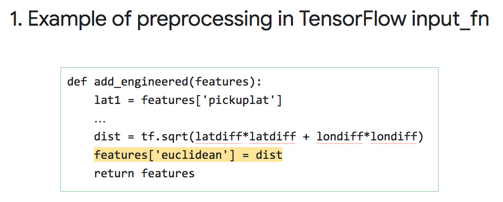
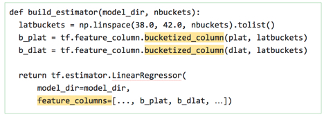

# Preprocessing and Feature Creation

This section of the module covers pre-processing and feature creation which are data processing techniques that can help you prepare a feature set for a machine learning system.

## Introduction

> [](https://youtu.be/H0maVBPKZ4g)

* Learn how to
    * Get started with preprocessing ad feature creation
    * Use Apache Beam and Cloud Dataflow for feature engineering
* Feature engineering often requires global statistics and vocabularies
    ```python
    features=['scaled_price'] = (features['prices'] - min_price) / (max_price - min_price)
    ```
    ```python
    tf.feature_column.categorical_with_vocabulary_list('city', keys=['San Diego', 'Los Angeles', 'San Francisco', 'Sacramento'])
    ```
    * How do you get full vocabulary of cities in the training dataset?
* Preprocess with
    * BigQuery
    * Apache Beam
    * TensorFlow
* Things that are commonly done in preprocessing
    * BigQuery
        * Remove examples that you don't want to train on
        * Compute vocabularies for categorical columns
        * Compute aggregate statistics for numeric columns
    * Apache Beam
        * Compute time-windowed statistics (e.g., number of products sold in previous hour) for use as input features
    * TensorFlow or Apache Beam
        * Scaling, discretization, etc. of numeric features
        * Splitting, lower-casing, etc. textual features
        * Resizing of input images
        * Normalizing volumn level of input audio
* Example of preprocessing in BigQuery
    ```sql
    SELECT
        (tolls_amount + fare_amount)
        AS fare_amount,
        DAYOFWEEK(pickup_datetime)
        AS dayofweek,
        HOUR(pickup_datetime)
        AS hourofday,
        ...
        FROM
            `nyc-tlc.yellow.trips`
        WHERE
            trip_distance > 0
    ```
* There are two places for feature creation in TensorFlow
    1. Features are preprocessed in `input_FN(train, eval, serving)`
        ```python
        features['capped_rooms'] = tf.clip_by_value(
            features['rooms'],
            clip_value_min=0,
            clip_value_max=4
        )
        ```
    2. Features columns are passed into estimator during construction
        ```python
        lat = tf.feature_column.numeric_column('latitude')
        dlat = tf.feature_column.bucketized_column(lat, boundaries=np.arange(32, 42, 1).tolist())
        ```
* Example of preprocessing in TensorFlow `input_FN`
    ```python
    def add_engineered(features):
        lat1 = features['pickuplat']
        ...
        dist = tf.sqrt(latdiff * latdiff + londiff * londiff)
        features['euclidean'] = dist
        return features
    ```
    * How do we make sure this function gets called during both training and prediction?
        * Wrap features by call to the feature engineering to function
            1. Wrap features in training/evaluation input function:
                ```python
                def input_fn():
                    features = ...
                    label = ...
                    return add_engineered(features), label
                ```
            2. Wrap features in serving input function also:
                ```python
                def serving_input_fn():
                    feature_placeholders = ...
                    features = ...
                    return tf.estimator.export.ServingInputReceiver(
                        add_engineered(features), feature_placeholders
                    )
                ```
* Example of preprocessing via feature column
    ```python
    def build_estimator(model_dir, nbuckets):
        latbuckets = np.linspace(38.0, 42.0, nbuckets).tolist()
        b_plat = tf.feature_column.bucketized_column(plat, latbuckets)
        b_dlat = tf.feature_column.bucketized_column(dlat, latbuckets)

        return tf.estimator.LinearRegressor(
            model_dir=model_dir,
            feature_columns=[..., b_plat, b_dlat, ...]
        )
    ```
* Example of preprocessing in Apache Beam
    * The same code can be used during both training and serving of a model
    ```python
    def to_csv(rowdict):
        if distance(rowdict['pickuplon'], ...) > 10:    # Only rides of more than 10km
            CSV_COLUMNS = 'fare_amount,dayofweek,...,key'.split(',')
            yield ','.join([str(rowdict[k]) for k in CSV_COLUMNS])
    
    def preprocess():
        ...
        for n, step in enumerate(['train', 'valid']):
            (p | 'read_{}'.format(step) >> beam.io.Read(beam.io.BigQuerySoruce(query=query))
            | 'tocsv_{}'.format(step) >> beam.FlatMap(to_csv)
            | 'write_{}'.format(step) >> beam.io.Write(beam.io.WriteToText(outfile)))
        p.run()
    ```

### Quiz

1. You are training a model to predict how long it will take to sell a house. The list price of the house, with numeric \$20,000 to \$500,000 values, is one of the inputs to the model. Which of these is a good practice?
    * A. Rescale the real valued feature like a price to a range from 0 to 1
    * B. Rescale the real valued feature like a price to a range from 0 to \$100,000
    * C. Rescale the real valued feature like a price to a categorical range from low, medium, high
    > Answer: A.
2. Which of these tools are commonly used for data pre-processing? (Select 3 correct responses)
    * A. Google Cloud Storage
    * B. Bigtable
    * C. Apache Beam
    * D. BigQuery
    * E. TensorFlow
    > Answer: C. D. E.
3. Which one of these is NOT something you would commonly do in data preprocessing?
    * A. Compute aggregate statistics for numeric columns
    * B. Compute time-windowed statistics (e.g. number of products sold in previous hour) for use as input features
    * C. Tune your ML model hyperparameters
    * D. Compute vocabularies for categorical columns
    * E. Remove examples that you don’t want to train on
    > Answer: C.
4. In your TensorFlow model you are calculating the distance between two points on a map as a new feature. How do you ensure the preprocessing you're doing for model training is also do the exact same way in prediction?
    
    * A. Wrap features in training/evaluation input function:
    * B. Wrap features in serving input function:
    * C. Wrap features in training/evaluation input function AND wrap features in serving input function:
    > Answer: C.
5. The below code preprocesses the latitude and longitude using feature columns. What is the point of the 38.0 and 42.0 in the column buckets?
    
    * A. These define how many samples to put into each bucket (at least 38 but no more than 42 in each small bucket)
    * B. Latitudes must be between 38 and 42 will be discretized into the specified number of bins.
    * C. These parameters ensure all latitudes in the raw dataset do not include 38 and 42 which we want to exclude for this dataset.
    > Answer: B.
6. What are two advantages of using TensorFlow to preprocess your code instead of building an Apache Beam pipeline? (Select two correct responses)
    * A. In TensorFlow the Apache Beam pipeline code is automatically generated for you
    * B. In TensorFlow the same pipelines can be used in both training and serving
    * C. In TensorFlow you will have access to helper APIs to help automatically bucketize and process features instead of writing your own java or python code
    > Answer: B. C.
7. What is one key advantage of preprocessing your features using Apache Beam?
    * A. Apache Beam transformations are written in Standard SQL which is scalable and easy to author
    * B. The same code you use to preprocess features in training and evaluation can also be used in serving
    * C. Apache Beam code is often harder to maintain and run at scale than BigQuery preprocessing pipelines
    > Answer: B.

---
## Apache Beam and Cloud Dataflow

> [](https://youtu.be/tJiV2-C_Zbs)

* Apache Beam is a way to write elastic data processing pipelines
    
* Cloud Dataflow allows user to run these kinds of data processing pipelines
    * Dataflow can run pipelines written in Python and Java programming languages
    * Dataflow sets itself apart as a platform for data transformation
    * Dataflow can change the amount of computer resources, the number of servers that will run your pipeline, and do that elastically
* Open-source API, Google Infrastructure
    
* The code is the same between real-time and batch
    
* Dataflow terms and concepts
    
* A pipeline is a directed graph of steps
    * E.g., Read in data, transform it, write out
    * Can branch, merge, use if-then statements, etc.
    * Python syntax
        ```python
        import apache_beam as beam
        if __name__ == '__main__':
            # Create a pipeline parameterized by commandline flags
            p = beam.Pipeline(argv=sys.argv)
            (p
                | 'Read' >> beam.io.ReadFromText('gs://...')    # Read input
                | 'Countwords' >> beam.FlatMap(lambda line: count_words(line))
                | 'Write' >> beam.io.WriteToText('gs://...')    # Write output
            )
            # Run the pipeline
            p.run()
        ```
* Every time you use the pipe operator, you provide a PCollection data structure as input and return PCollection as output
    * PCollections does not store all of its data in memory
    * PCollections is like a data structure with pointers to where the data flow cluster stores your data
        ```java
        import org.apache.beam.sdk.Pipeline;
        public static void main(String[] args) {
            // Create a pipeline parameterized by commandline flags
            Pipeline p = Pipeline.create(PipelineOptionFactory.fromArgs(args));
            p.apply(TextIO.read().from("gs://..."))     // Read input
                .apply(new CountWords())                // Do some processing
                .apply(TextIO().write().to("gs://...")) // Write output
            // Run the pipeline
            p.run();
        }
        ```
* Apply Transform to PCollection (Python)
    * Data in a pipeline are represented by PCollection
        * Supports parallel processing
        * Not an in-memory collection; can be unbounded
            ```python
            lines = p | ...
            ```
        * Apply Transform to PCollection; return PCollection
            ```python
            sizes = lines | 'length' >> beam.Map(lambda line: len(line))
            ```
* Ingesting data into a pipeline (Python)
    * Read data from file system, GCS or BigQuery
        * Text formats return String
            ```python
            lines = beam.io.ReadFromText('gs://.../input-*.csv.gz')
            ```
        * BigQuery returns a TableRow
            ```python
            rows = beam.io.Read(beam.io.BigQuerySource(query='SELECT x, y, z' \ 
            'FROM [project:dataset.tablename]', project='PROJECT'))
            ```
* Can write data out to some formats (Python)
    * Write data to file system, GCS or BigQuery
        ```python
        beam.io.WriteToText(file_path_prefix='/data/output/', file_name_suffix='.txt')
        ```
    * Can prevent sharding of output (do only if it is small)
        ```python
        beam.io.WriteToText(file_path_prefix='/data/output/', file_name_suffix='.txt', num_shards=1)
        ```
        * The output must be a PCollection of Strings before writing out
* Executing pipeline (Python)
    * Simply running `main()` runs pipeline locally
        ```bash
        $ python ./grep.py
        ```
    * To run on cloud, specify cloud parameters, and submit the job to Dataflow
        ```bash
        $ python ./grep.py \
            --project=$PROJECT \
            --job_name=myjob \
            --staging_location=gs://$BUCKET/staging/ \
            --temp_location=gs://$BUCKET/staging/ \
            --runner=DataflowRunner
        ```

### Data Pipelines that Scale

> [](https://youtu.be/sFAZDhCsVmg)

* MapReduce approach splits Big Data so that each compute node processes data local to it
    
* ParDo allows for parallel processing
    * ParDo acts on one item at a time (like a Map in MapReduce)
        * Multiple instances of class on many machines
        * Should not contain any state
    * Useful for:
        * Filtering (choosing which inputs to emit)
        * Extracting parts of an input (e.g., fields of TableRow)
        * Converting one Java type to another
        * Calculating values from different parts of inputs


### Quiz


---
## Lab 2: Simple Dataflow Pipeline

> [](https://youtu.be/MuGLJFYtHVU)
> [](https://youtu.be/2WzwpcMEZgU)

* Please follow the details in [here](./Lab-2.md)

---
## Lab 3: MapReduce in Dataflow

> [](https://youtu.be/)
> [](https://youtu.be/)


---
## Preprocessing with Cloud Dataprep

> [](https://youtu.be/)


### Quiz


### Discussion Prompt: Performing Exploratory Analysis


---
## Lab 4: Computing Time-windowed Features in Cloud Dataprep

> [](https://youtu.be/)
> [](https://youtu.be/)

