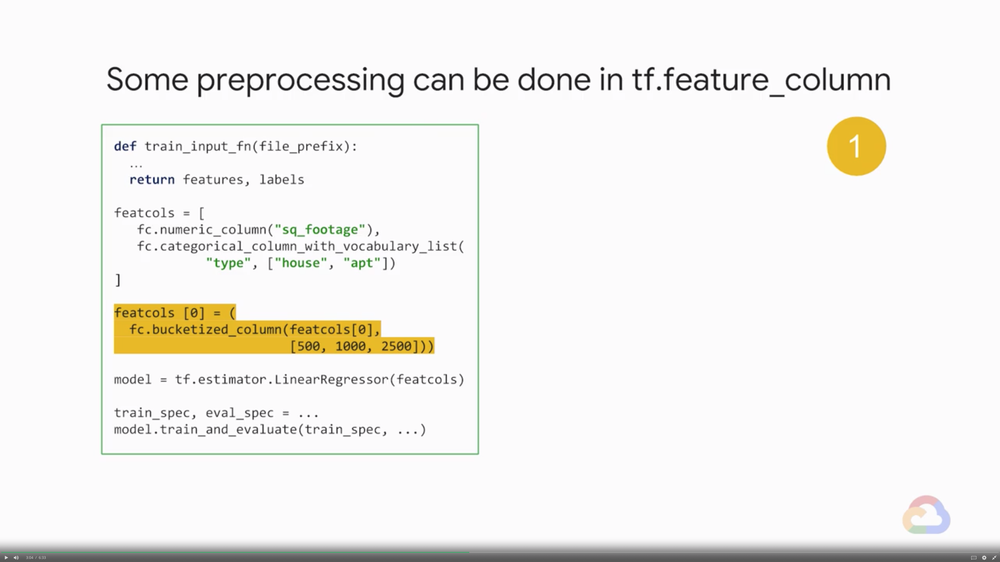
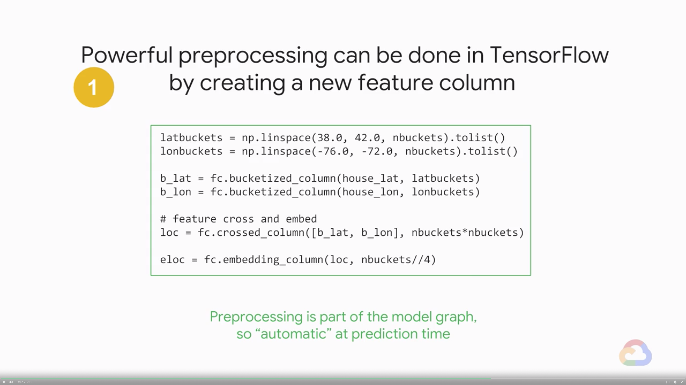
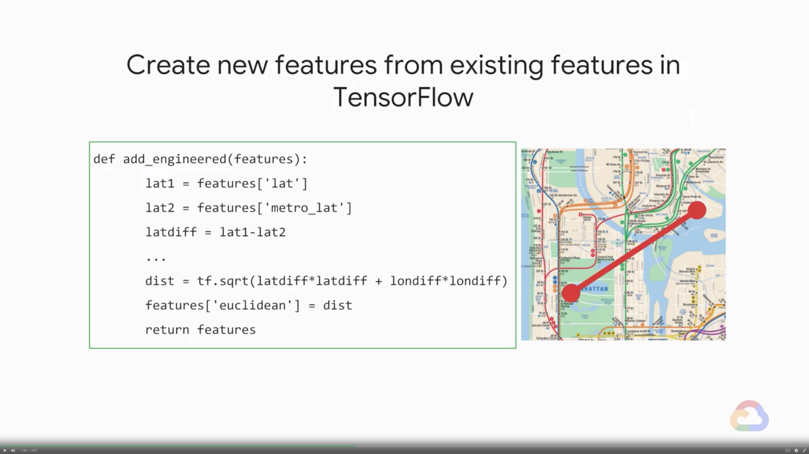
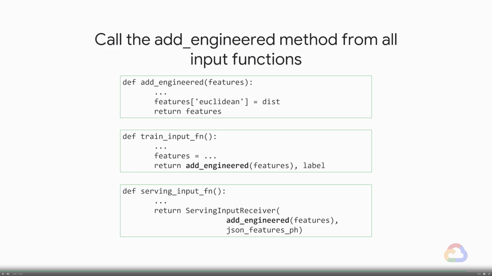
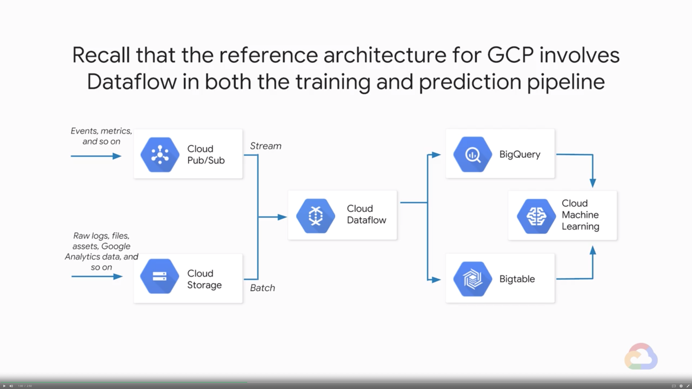
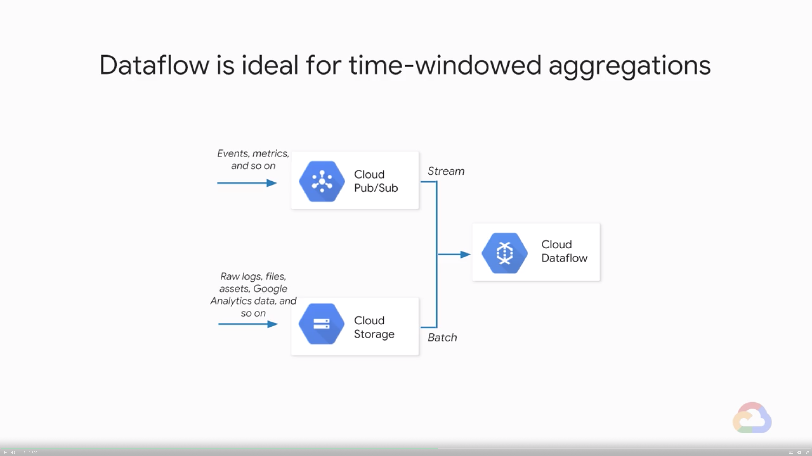
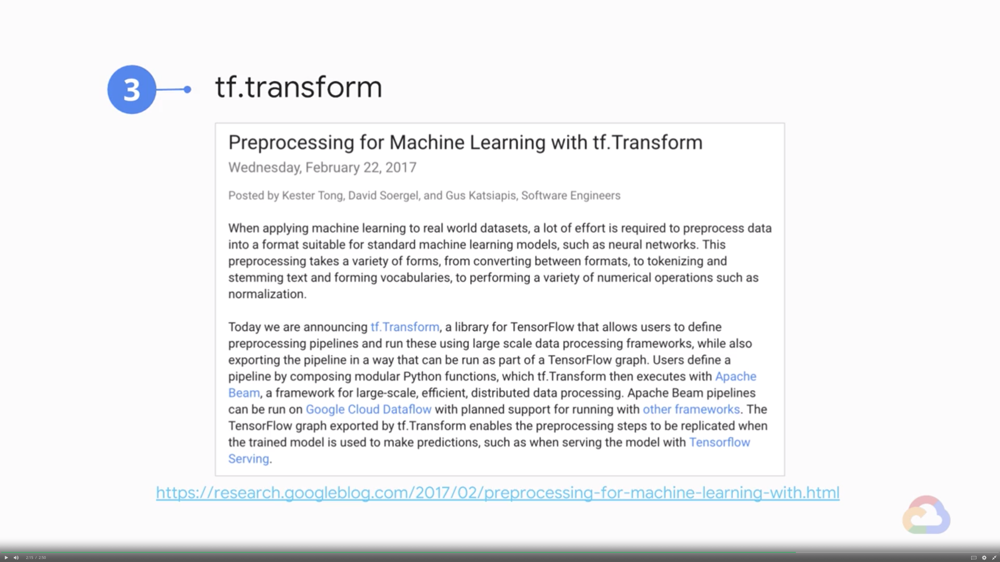

# Introducing 

In traditional machine learning, feature crosses don’t play much of a role, but in modern-day ML methods, feature crosses are an invaluable part of your toolkit. In this module, you will learn how to recognize the kinds of problems where feature crosses are a powerful way to help machines learn.

## Introduction

> [](https://youtu.be/zSR-_a8P63M)

* Learn how to ...
    * Recognize where feature crosses are a powerful way to help machines learn
    * Implement feature crosses in TensorFlow
    * Incopoerate feature creation as part of your ML pipeline
    * Improve the taxifare model using feature crosses

---
## What is a Feature Cross?

> [](https://youtu.be/kxZfu2Anu6s)

* The feature cross provides a way to combine features in a linear model
    * Using non-linear inputs in a linear learner

---
## Discretization

> [](https://youtu.be/jXkkcF-xQ5I)

---
## Memorization vs. Generalization

> [](https://youtu.be/R8evI4-EyJc)

* A feature cross memorize the input space
* Goal of ML is generalization
* Memorization works when you have lots of data
* Feature crosses are powerful

---
## Taxi Colors

> [](https://youtu.be/YRZkcp2ZIjI)

* Which of these cars is a taxi?
    * Assume that your input data looks like this
        * e.g., Red, Rome; White, Rome; Yellow, NYC; White, NYC; ...
    * The linear model has problems; the feature cross has no problem
* Feature crosses bring a lot of power to linear model
    * Feature crosses + massive data is an efficient way of learning highly complex spaces
    * Feature crosses allow a linear model to memorize large datasets
    * Optimizing linear models is a convex problem
    * Before TensorFlow, Google used massive scale learners

---
## Lab 5: Feature Crosses to Create a Good Classifier

> [](https://youtu.be/w5AV3NXa3FQ)
> [](https://youtu.be/8LujL7KG5uk)

* Please follow the details in [here](./Lab-5.md)

---
## Sparsity

> [](https://youtu.be/_u7UXnpOEt0)

* Feature crosses combine discrete / categorical features
    * E.g., Cross `hour_of_day` with `day_of_week` to predict traffic
        * How many inputs would we have if we simply one-hot-encoded the hour of day and the day of week and provided it to a model?
            > Answer: 24 input nodes for hours in the day + 7 inputs for days of the week = 31
        * How many inputs do we now have for our model?
            > Answer: 24 x 7 inputs = 168 total inputs
* Feature crosses lead to sparsity
    * E.g., Cross `hour_of_day` with `day_of_week` to predict traffic
        * How many nodes in $x_3$ will be lit up for a single input from $x_1$ and $x_2$?
            > Answer: 1

### Quiz

* Which of these is a good feature cross?
    * Different cities in California have markedly different housing prices. Suppose you must create a model to predict housing prices. Which of the following sets of features or feature crosses could learn city-specific relationships between house characteristic and housing price?
        * A. Two feature crosses: [binned latitude X binned roomsPerPerson] and [binned longitude X binned roomsPerPerson]
        * B. One feature cross: [latitude X longitude X roomsPerPerson]
        * C. One feature cross: [binned latitude X binned longitude X binned roomsPerPerson]
        * D. Three separate binned features: [binned latitude], [binned longitude], [binned roomsPerPerson]
        > Answer: C.
        > Yes. Crossing binned latitude with binned longitude enables the model to learn city-specific effects of roomsPerPerson. Binning prevents a change in latitude producing the same result as a change in longitude. Depending on the granularity of the bins, this feature cross could learn city-specific or neighborhood-specific or even block-specific effects.

---
## Lab 6: Too Much of a Good Thing

> [](https://youtu.be/rCZhZlsNydc)
> [](https://youtu.be/Nj1EtL7SzC0)

* Please follow the details in [here](./Lab-6.md)

---
## Implementing Feature Crosses

> [](https://youtu.be/82LJIOneOac)

* Create feature crosses using TensorFlow
    ```python
    day_hr = tf.feature_column.crossed_column(
        [dayofweek, hourofday],
        24 * 7)
    ```
    * You can cross two or more categorical or bucketized columns
    * `24 * 7` is the number of hash buckets: `feature_cross % hash_bucket_size`
* Choosing the number of hash buckets is an art, not a science
* The number of hash buckets controls sparsity and collisions
    * Small `hash_buckets`, lots of collision
    * High `hash_buckets`, very sparse
* Some expericen: choose a number between $\frac{1}{2}\sqrt{n}$ and $2n$

---
## Embedding Feature

> [](https://youtu.be/KYxH8Nd9xAc)

* Creating an embedding column from a feature cross 
    * The weights in the embedding column are learned from data
        * ML is a way to learn the long tail to make fine grained predictions and derive insights beyond just a gross averages
    * The model learns how to embed the feature cross in lower-dimensional space
* Transfer learning of embeddings from similar ML models
* To create an embedding, use the embedding column method in TFF feature column
* Embedding features that you have learned from on one problem can often apply to their similar ML models
* Embedding features are an extremely powerful concept, and transfer learning of embeddings makes them even more so

---
## Module Quiz

1. You are building a model to predict the number of points ("margin") by which Team A will beat Team B in a basketball game. Your input features are (1) whether or not it it is a home game for Team A (2) average number of points Team A scored in its past 7 games and (3) average number of points Team B scored in its past 7 games. Which of these is a linear model suitable for machine learning?
    * A. `margin = b + w1 * is_home_game + w2 * avg_points_A + w3 * avg_points_B`
    * B. `margin = w1 * is_home + w2 * (avg_points_A - avg_points_B)^3`
    * C. `margin = (avg_points_A - avg_points_B)`
    * D. `margin = w1 * is_home + w1^2 * avg_points_A + w1^3 * avg_points_B`
    > Answer: A. B.
2. Feature crosses are more common in modern machine learning because:
    * A. Feature crosses work only with neural networks
    * B. People didn't know about feature crosses 10 years ago
    * C. Feature crosses require GPUs in order to compute efficiently
    * D. Feature crosses memorize, and that is okay only if you have extremely large datasets.
    > Answer: D.
3. The function tf.feature_column.crossed_column requires:
    * A. A list of categorical or bucketized features
    * B. A list of numeric features
    * C. A list of bucketized features
    * D. A list of categorical features
    > Answer: A.
4. You might create an embedding of a feature cross in order to:
    * A. Create a lower-dimensional representation of the input space
    * B. Identify similar sets of inputs for clustering
    * C. Reuse weights learned in one problem in another problem
    > Answer: A. B. C.

---
## Where to Do Feature Engineering

> [](https://youtu.be/huQVHz4FCX8)

* Where does the feature engineering code fit in?
    ```python
    def train_input_fn(file_prefix):
        ...
        return features, labels
    
    featcols = [
        fc.numeric_column('sq_footage'),
        fc.categorical_column_with_vocabulary_list(
            'type', ['house', 'apt']
        )
    ]

    model = tf.estimator.LinearRegressor(featcols)
    train_spec, eval_spec = ...
    model.train_and_evaluate(train_spec, ...)
    ```
* Three possible places to do feature engineering
    
* Some preprocessing can be done in `tf.feature_column`
    
* Powerful preprocessing can be done in TensorFlow by creating a new feature column
    

---
## Feature Creation in TensorFlow

> [](https://youtu.be/s7uYfTLKOHg)

* Recall that the input function returns features and labels
    * What us the data type of features? Python dictionary
* Create new features from existing features in TensorFlow
    
* Call the `add_engineered` method from all input functions
    

---
## Feature Creation in Dataflow

> [](https://youtu.be/v_Q51vsunkU)

* Recall that the reference architecture for GCP involves Dataflow in both the training and prediction pipeline
    
* Dataflow is ideal for time-windowed aggregations
    
* Adding new features in Dataflow is like any other PTrandform
    
* `tf.transform`
    

---
## Lab 7: Improve ML Model with Feature Engineering

> [](https://youtu.be/S5a_-SVFcgM)
> [](https://youtu.be/4YAcN3-xxt8)
> [](https://youtu.be/tWIRElgMLyU)

* Please follow the details in [here](./Lab-7.md)

---
