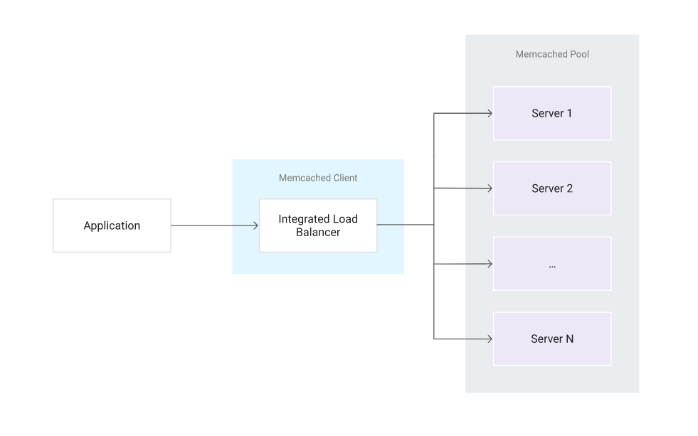
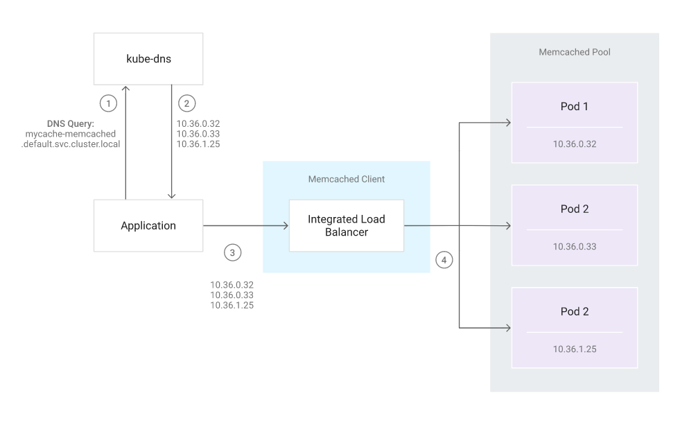
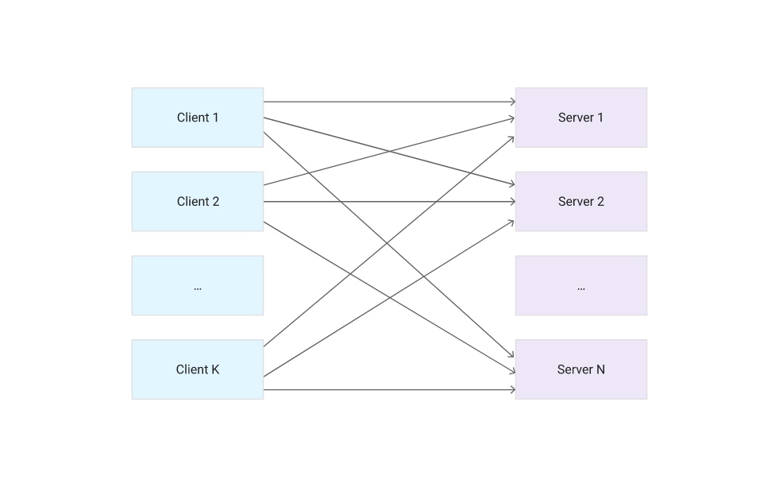
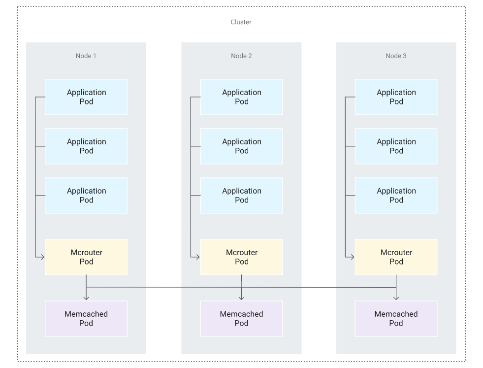

# Deploying Memcached on Kubernetes Engine

## GSP116


In this lab you'll learn how to deploy a cluster of distributed [Memcached](https://memcached.org/) servers on [Kubernetes Engine](https://cloud.google.com/kubernetes-engine/) using [Kubernetes](https://kubernetes.io/), [Helm](https://helm.sh/), and [Mcrouter](https://github.com/facebook/mcrouter). Memcached is one of the most popular open source, multi-purpose caching systems. It usually serves as a temporary store for frequently used data to speed up web applications and lighten database loads.

### Objectives

* Learn about some characteristics of Memcached's distributed architecture.
* Deploy a Memcached service to Kubernetes Engine using Kubernetes and Helm.
* Deploy Mcrouter, an open source Memcached proxy, to improve the system's performance.

### Memcached's characteristics

Memcached has two main design goals:

* **Simplicity**: Memcached functions like a large hash table and offers a simple API to store and retrieve arbitrarily shaped objects by key.
* **Speed**: Memcached holds cache data exclusively in random-access memory (RAM), making data access extremely fast.

Memcached is a distributed system that allows its hash table capacity to scale horizontally across a pool of servers. Each Memcached server operates in complete isolation from the other servers in the pool. Therefore, the routing and load balancing between the servers must be done at the client level. Memcached clients apply a consistent hashing scheme to appropriately select the target servers. This scheme guarantees the following conditions:

* The same server is always selected for the same key.
* Memory usage is evenly balanced between the servers.
* A minimum number of keys are relocated when the pool of servers is reduced or expanded.

The following diagram illustrates at a high level the interaction between a Memcached client and a distributed pool of Memcached servers.



---
## Setup and Requirements

### Before you click the Start Lab button

Read these instructions. Labs are timed and you cannot pause them. The timer, which starts when you click Start Lab, shows how long Cloud resources will be made available to you.

This Qwiklabs hands-on lab lets you do the lab activities yourself in a real cloud environment, not in a simulation or demo environment. It does so by giving you new, temporary credentials that you use to sign in and access the Google Cloud Platform for the duration of the lab.

### What you need

To complete this lab, you need:

* Access to a standard internet browser (Chrome browser recommended).
* Time to complete the lab.
* **Note:** If you already have your own personal GCP account or project, do not use it for this lab.

### How to start your lab and sign in to the Console

1. Click the `Start Lab` button. If you need to pay for the lab, a pop-up opens for you to select your payment method. On the left you will see a panel populated with the temporary credentials that you must use for this lab.
    
2. Copy the username, and then click `Open Google Console`. The lab spins up resources, and then opens another tab that shows the **Choose an account** page.
    * **Tip:** Open the tabs in separate windows, side-by-side.
3. On the Choose an account page, click `Use Another Account`.
    
4. The Sign in page opens. Paste the username that you copied from the Connection Details panel. Then copy and paste the password.
    * **Important:** You must use the credentials from the Connection Details panel. Do not use your Qwiklabs credentials. If you have your own GCP account, do not use it for this lab (avoids incurring charges).
5. Click through the subsequent pages:
    * Accept the terms and conditions.
    * Do not add recovery options or two-factor authentication (because this is a temporary account).
    * Do not sign up for free trials.
6. After a few moments, the GCP console opens in this tab.
    * **Note:** You can view the menu with a list of GCP Products and Services by clicking the Navigation menu at the top-left, next to “Google Cloud Platform”.
    

---
## Activate Google Cloud Shell

Google Cloud Shell is a virtual machine that is loaded with development tools. It offers a persistent 5GB home directory and runs on the Google Cloud. Google Cloud Shell provides command-line access to your GCP resources.

1. In GCP console, on the top right toolbar, click the `Open Cloud Shell` button.
    
2. In the dialog box that opens, click `START CLOUD SHELL`:
    
    * **Note:** You can click `START CLOUD SHELL` immediately when the dialog box opens.
3. It takes a few moments to provision and connect to the environment. When you are connected, you are already authenticated, and the project is set to your `PROJECT_ID`. For example:
    
    * `gcloud` is the command-line tool for Google Cloud Platform. It comes pre-installed on Cloud Shell and supports tab-completion.
        * You can list the active account name with this command:
            ```bash
            $ gcloud auth list
            # Output:
            Credentialed accounts:
            - <myaccount>@<mydomain>.com (active)
            # Example output:
            Credentialed accounts:
            - google1623327_student@qwiklabs.net
            ```
        * You can list the project ID with this command:
            ```bash
            $ gcloud config list project
            # Output:
            [core]
            project = <project_ID>
            # Example output:
            [core]
            project = qwiklabs-gcp-44776a13dea667a6
            ```
    * **Note:** Full documentation of `gcloud` is available on [Google Cloud gcloud Overview](https://cloud.google.com/sdk/gcloud).

---
## Deploying a Memcached service

A simple way to deploy a Memcached service to Kubernetes Engine is to use a Helm chart.

1. In Cloud Shell, create a new Kubernetes Engine cluster of three nodes:
    ```bash
    $ gcloud container clusters create demo-cluster --num-nodes 3 --zone us-central1-f
    ```
    * This deployment will take between five and ten minutes to complete. You may see a warning about default scopes that you can safely ignore as it has no impact on this lab.
    * **Note:** The cluster's zone specified here is arbitrary. You can select another zone for your cluster from the available zones.
2. Download the Helm binary archive:
    ```bash
    $ cd ~
    $ wget https://kubernetes-helm.storage.googleapis.com/helm-v2.6.0-linux-amd64.tar.gz
    ```
3. Unzip the archive file to your local system:
    ```bash
    $ mkdir helm-v2.6.0
    $ tar zxfv helm-v2.6.0-linux-amd64.tar.gz -C helm-v2.6.0
    ```
4. Add the Helm binary's directory to your `PATH` environment variable:
    ```bash
    $ export PATH="$(echo ~)/helm-v2.6.0/linux-amd64:$PATH"
    ```
    * This command makes the Helm binary discoverable from any directory during the current Cloud Shell session. To make this configuration persist across multiple sessions, add the command to your Cloud Shell user's `~/.bashrc` file.
5. Create a service account with the cluster admin role for Tiller, the Helm server:
    ```bash
    $ kubectl create serviceaccount --namespace kube-system tiller
    $ kubectl create clusterrolebinding tiller --clusterrole=cluster-admin --serviceaccount=kube-system:tiller
    ```
6. Initialize Tiller in your cluster, and update information of available charts:
    ```bash
    $ helm init --service-account tiller
    $ helm repo update
    ```
7. Install a new [Memcached Helm chart](https://github.com/kubernetes/charts/tree/master/stable/memcached) release with three replicas, one for each node
    ```bash
    $ helm install stable/memcached --name mycache --set replicaCount=3
    ```
    * The Memcached Helm chart uses a [StatefulSet controller](https://kubernetes.io/docs/concepts/workloads/controllers/statefulset/). One benefit of using a StatefulSet controller is that the pods' names are ordered and predictable. In this case, the names are `mycache-memcached-{0..2}`. This ordering makes it easier for Memcached clients to reference the servers.
    * **Note:** If you get: `"Error: could not find a ready tiller pod."` wait a few seconds and retry the Helm install command. The tiller pod may not have had time to initialize.
8. Execute the following command to see the running pods:
    ```bash
    $ kubectl get pods
    # Example output:
    NAME                  READY     STATUS    RESTARTS   AGE
    mycache-memcached-0   1/1       Running   0          45s
    mycache-memcached-1   1/1       Running   0          35s
    mycache-memcached-2   1/1       Running   0          25s
    ```
    * You may need to run the previous command again to see all three pods in the `Ready 1/1` status.

### Discovering Memcached service endpoints

The Memcached Helm chart uses a headless service. A headless service exposes IP addresses for all of its pods so that they can be individually discovered.

1. Verify that the deployed service is headless:
    ```bash
    $ kubectl get service mycache-memcached -o jsonpath="{.spec.clusterIP}" ; echo
    ```
    * The output `None` confirms that the service has no clusterIP and that it is therefore headless.
    * In this lab the service creates a DNS record for a hostname of the form: `[SERVICE_NAME].[NAMESPACE].svc.cluster.local`

In this lab the service name is `mycache-memcached`. Because a namespace was not explicitly defined, the default namespace is used, and therefore the entire hostname is `mycache-memcached.default.svc.cluster.local`. This hostname resolves to a set of IP addresses and domains for all three pods exposed by the service. If, in the future, some pods get added to the pool, or old ones get removed, `kube-dns` will automatically update the DNS record.

It is the client's responsibility to discover the Memcached service endpoints. To do that:

2. Retrieve the endpoints' IP addresses:
    ```bash
    $ kubectl get endpoints mycache-memcached
    # Example output:
    NAME                ENDPOINTS                                            AGE
    mycache-memcached   10.36.0.32:11211,10.36.0.33:11211,10.36.1.25:11211   3m
    ```

Notice that each Memcached pod has a separate IP address. These IP addresses might differ for your own server instances. Each pod listens to port 11211, which is Memcached's default port.

3. There are a number of alternative methods that can be used such as theses two optional examples. You can carry out these steps if you have time, or move directly to the next step where you test the deployment using `telnet`:
    * **Alternate Methods:** You can retrieve those same records using a standard DNS query with the nslookup command:
        ```bash
        $ kubectl run -it --rm alpine --image=alpine:3.6 --restart=Never nslookup mycache-memcached.default.svc.cluster.local
        # Example output:
        Name:      mycache-memcached.default.svc.cluster.local
        Address 1: 10.36.0.32 mycache-memcached-0.mycache-memcached.default.svc.cluster.local
        Address 2: 10.36.0.33 mycache-memcached-2.mycache-memcached.default.svc.cluster.local
        Address 3: 10.36.1.25 mycache-memcached-1.mycache-memcached.default.svc.cluster.local
        ```
        * You can ignore the `nslookup: can't resolve '(null)': Name does not resolve` flag if it shows up. Notice that each server has its own domain name of the following form: `[POD_NAME].[SERVICE_NAME].[NAMESPACE].svc.cluster.local`
        * For example, the domain for the `mycache-memcached-0` pod is: `Mycache-memcached-0.mycache-memcached.default.svc.cluster.local`
        * For another alternative approach, you can perform the same DNS inspection by using a programming language like Python:
            * Start a Python interactive console inside your cluster:
                ```bash
                $ kubectl run -it --rm python --image=python:3.6-alpine --restart=Never python
                ```
            * In the Python console, run these commands:
                ```python
                import socket
                print(socket.gethostbyname_ex('mycache-memcached.default.svc.cluster.local'))
                exit()
                ```
                * The output is similar to the following and is echoed to the console before the `exit()` command:
                    ```bash
                    ('mycache-memcached.default.svc.cluster.local', ['mycache-memcached.default.svc.cluster.local'], ['10.36.0.32', '10.36.0.33', '10.36.1.25'])
                    ```
    * Test the deployment by opening a `telnet` session with one of the running Memcached servers on port `11211`:
        ```bash
        $ kubectl run -it --rm alpine --image=alpine:3.6 --restart=Never telnet mycache-memcached-0.mycache-memcached.default.svc.cluster.local 11211
        ```
        * This will open a session to the telnet interface with **no obvious prompt**. Don't mind the `If you don't see a command prompt, try pressing enter`--you can start plugging in commands right away (even if the formatting looks a little off.)
        * At the telnet prompt run these commands using the [Memcached ASCII](https://github.com/memcached/memcached/blob/master/doc/protocol.txt) protocol to confirm that telnet is actually connected to a Memcached server instance. As this is a telnet session, enter each set of commands and wait for the response to avoid getting commands and responses mixed on the console.
        * Store the key:
            ```bash
            set mykey 0 0 5
            hello
            ```
        * Press `ENTER` and you will see the response:
            ```bash
            STORED
            ```
        * Retrieve the key:
            ```bash
            get mykey
            ```
        * Press `ENTER` and you will see the response:
            ```bash
            VALUE mykey 0 5
            hello
            END
            ```
        * Quit the telnet session:
            ```bash
            quit
            ```
        * Press `ENTER` to close the session if it does not automatically exit.

---
## Implementing the service discovery logic

You are now ready to implement the basic service discovery logic shown in the following diagram.



At a high level, the service discovery logic consists of the following steps:

1. The application queries kube-dns for the DNS record of `mycache-memcached.default.svc.cluster.local`.
2. The application retrieves the IP addresses associated with that record.
3. The application instantiates a new Memcached client and provides it with the retrieved IP addresses.
4. The Memcached client's integrated load balancer connects to the Memcached servers at the given IP addresses.

### Implement the service discovery logic

You now implement this service discovery logic by using Python.

1. Deploy a new Python-enabled pod in your cluster and start a shell session inside the pod:
    ```bash
    $ kubectl run -it --rm python --image=python:3.6-alpine --restart=Never sh
    ```
2. Once you get a shell prompt (`/ #`) install the `pymemcache` library:
    ```bash
    / # pip install pymemcache
    ```
3. Start a Python interactive console by running the `python` command.
    ```bash
    / # python
    ```
4. In the Python console (`>>>`), run the following:
    ```python
    >>> import socket
    >>> from pymemcache.client.hash import HashClient
    >>> _, _, ips = socket.gethostbyname_ex('mycache-memcached.default.svc.cluster.local')
    >>> servers = [(ip, 11211) for ip in ips]
    >>> client = HashClient(servers, use_pooling=True)
    >>> client.set('mykey', 'hello')
    >>> client.get('mykey')
    ```
    * The output that results from the last command:
        ```python
        b'hello'
        ```
    * The `b` prefix signifies a bytes literal, which is the format in which Memcached stores data.
5. Exit the Python console:
    ```python
    >>> exit()
    ```
6. Exit the pod's shell session by pressing `CTRL + D`.

---
## Enabling connection pooling

As your caching needs grow, and the pool scales up to dozens, hundreds, or thousands of Memcached servers, you might run into some limitations. In particular, the large number of open connections from Memcached clients might place a heavy load on the servers, as the following diagram shows.



To reduce the number of open connections, you must introduce a proxy to enable connection pooling, as in the following diagram.


[Mcrouter](https://github.com/facebook/mcrouter) (pronounced "mick router"), a powerful open source Memcached proxy, enables connection pooling. Integrating Mcrouter is seamless, because it uses the standard Memcached ASCII protocol. To a Memcached client, Mcrouter behaves like a normal Memcached server. To a Memcached server, Mcrouter behaves like a normal Memcached client.

### Deploy Mcrouter

To deploy Mcrouter, run the following commands in Cloud Shell.

1. Delete the previously installed mycache Helm chart release:
    ```bash
    $ helm delete mycache --purge
    # Output:
    Release "mycache" deleted
    ```
2. Deploy new Memcached pods and Mcrouter pods by installing a new [Mcrouter Helm chart](https://github.com/kubernetes/charts/tree/master/stable/mcrouter) release:
    ```bash
    $ helm install stable/mcrouter --name=mycache --set memcached.replicaCount=3
    ```
3. Check the status of the sample application deployment:
    ```bash
    $ kubectl get pods
    ```

Repeat the `kubectl get pods` command periodically until all 3 of the `mycache-mcrouter` pods report a `STATUS of Running` and a `READY` state of `1/1`. This may take a couple of minutes. Three `mycache-memcached` pods are also started by this command and they will initialize first, however you must wait for the `mycache-mcrouter` pods to be fully ready before proceeding or the pod ip-addresses will not be configured.

4. Once you see the `READY` state of `1/1` the `mycache-mcrouter` proxy pods are now ready to accept requests from client applications.
5. Test this setup by connecting to one of the proxy pods. Use the `telnet` command on port `5000`, which is Mcrouter's default port.
    ```bash
    $ MCROUTER_POD_IP=$(kubectl get pods -l app=mycache-mcrouter -o jsonpath="{.items[0].status.podIP}")
    $ kubectl run -it --rm alpine --image=alpine:3.6 --restart=Never telnet $MCROUTER_POD_IP 5000
    ```
    * This will open a session to the `telnet` interface with no obvious prompt. It'll be ready right away.
6. In the `telnet` prompt, run these commands to test the Mcrouter configuration:
    * Store the key
        ```
        set anotherkey 0 0 15
        Mcrouter is fun
        ```
    * Press `ENTER` and you will see the response:
        ```
        STORED
        ```
    * Retrieve the key:
        ```
        get anotherkey
        ```
    * Press `ENTER` and you will see the response:
        ```
        VALUE anotherkey 0 15
        Mcrouter is fun
        END
        ```
    * Quit the telnet session.
        ```
        quit
        ```

You have now deployed a proxy that enables connection pooling.

---
## Reducing latency

To increase resilience, it is common practice to use a cluster with multiple nodes. This lab uses a cluster with three nodes. However, using multiple nodes also brings the risk of increased latency caused by heavier network traffic between nodes.

### Colocating proxy pods

You can reduce the latency risk by connecting client application pods only to a Memcached proxy pod that is on the same node. The following diagram illustrates this configuration which shows the topology for the interactions between application pods, Mcrouter pods, and Memcached pods across a cluster of three nodes.



In a production environment, you would create this configuration as follows:

1. Ensure that each node contains one running proxy pod. A common approach is to deploy the proxy pods with a [DaemonSet controller](https://kubernetes.io/docs/concepts/workloads/controllers/daemonset). As nodes are added to the cluster, new proxy pods are automatically added to them. As nodes are removed from the cluster, those pods are garbage-collected. In this lab, the Mcrouter Helm chart that you deployed earlier [uses a DaemonSet controller](https://github.com/kubernetes/charts/blob/master/stable/mcrouter/templates/daemonset.yaml) by default. So this step is already complete.
2. Set a [`hostPort`](https://v1-7.docs.kubernetes.io/docs/api-reference/v1.7/#containerport-v1-core) value in the proxy container's Kubernetes parameters to make the node listen to that port and redirect traffic to the proxy. In this lab, the Mcrouter Helm chart uses this parameter by default for port `5000`. So this step is also already complete.
3. Expose the node name as an environment variable inside the application pods by using the `spec.env` entry and selecting the `spec.nodeName` `fieldRef` value. See more about this method in the [Kubernetes documentation](https://kubernetes.io/docs/tasks/inject-data-application/environment-variable-expose-pod-information/). You will perform this step in the next section.

### Configure Application Pods to Expose the Kubernetes Node Name as an Environment Variable

1. Deploy some sample application pods with the `NODE_NAME` environment variable configured to contain the Kubernetes node name by entering the following in the Google Cloud Shell:
    ```
    cat <<EOF | kubectl create -f -
    apiVersion: extensions/v1beta1
    kind: Deployment
    metadata:
    name: sample-application-py
    spec:
    replicas: 5
    template:
        metadata:
        labels:
            app: sample-application-py
        spec:
        containers:
            - name: python
            image: python:3.6-alpine
            command: [ "sh", "-c"]
            args:
            - while true; do sleep 10; done;
            env:
                - name: NODE_NAME
                valueFrom:
                    fieldRef:
                    fieldPath: spec.nodeName
    EOF
    ```
2. Enter the following command to check the status of the `sample application-py` deployment:
    ```bash
    $ kubectl get pods
    ```
    * Repeat the `kubectl get pods` command until all 5 of the `sample-application` pods report a `Status` of `Running` and a `READY` state of `1/1`. This may take a minute or two.
3. Verify that the node name is exposed to each pod, by looking inside one of the sample application pods:
    ```bash
    $ POD=$(kubectl get pods -l app=sample-application-py -o jsonpath="{.items[0].metadata.name}")
    $ kubectl exec -it $POD -- sh -c 'echo $NODE_NAME'
    # Output:
    gke-demo-cluster-default-pool-XXXXXXXX-XXXX
    ```

### Connecting the pods

The sample application pods are now ready to connect to the Mcrouter pod that runs on their respective mutual nodes at port `5000`, which is Mcrouter's default port.

1. Use the node name that was outputted when you ran the previous command (`kubectl exec -it $POD -- sh -c 'echo $NODE_NAME`) and use it in the following to initiate a connection for one of the pods by opening a `telnet` session:
    ```bash
    $ kubectl run -it --rm alpine --image=alpine:3.6 --restart=Never telnet gke-demo-cluster-default-pool-XXXXXXXX-XXXX 5000
    # Example output:
    If you don't see a command prompt, try pressing enter.
    ```
2. Remember, `telnet` prompts aren't obvious, so you can start plugging commands in right away. In the `telnet` prompt, run these commands:
    ```
    get anotherkey
    ```
3. This command outputs the value of this key that we set on the memcached cluster using Mcrouter in the previous section:
    ```bash
    VALUE anotherkey 0 15
    Mcrouter is fun
    END
    ```
4. Quit the `telnet` session.
    ```bash
    quit
    ```
5. Finally, to demonstrate using code, open up a shell on one of the application nodes and prepare an interactive Python session.
    ```bash
    $ kubectl exec -it $POD -- sh
    / # pip install pymemcache
    / # python
    ```
6. On the Python command line, enter the following Python commands that set and retrieve a key value using the `NODE_NAME` environment variable to locate the Mcrouter node from the application's environment. This variable was set in the sample application configuration.
    ```python
    >>> import os
    >>> from pymemcache.client.base import Client

    >>> NODE_NAME = os.environ['NODE_NAME']
    >>> client = Client((NODE_NAME, 5000))
    >>> client.set('some_key', 'some_value')
    >>> result = client.get('some_key')
    >>> result
    ```
    * You will see output similar to:
        ```python
        b'some_value'
        ```
7. Finally retrieve the key value you set earlier:
    ```python
    >>> result = client.get('anotherkey')
    >>> result
    ```
    * You will see output similar to:
        ```python
        b'Mcrouter is fun'
        ```
8. Exit the Python interactive console
    ```python
    >>> exit()
    ```
9. Then press `CTRL + D` to close the shell to the sample application pod.

---
## Congratulations!

You have now completed the Deploying Memcached on Kubernetes Engine lab.

### Finish Your Quest

This self-paced lab is part of the Qwiklabs Quest, [Google Cloud Solutions I: Scaling Your Infrastructure](https://google.qwiklabs.com/quests/36). A Quest is a series of related labs that form a learning path. Completing this Quest earns you the badge above, to recognize your achievement. You can make your badge (or badges) public and link to them in your online resume or social media account. Enroll in this Quest and get immediate completion credit if you've taken this lab. [See other available Qwiklabs Quests](https://google.qwiklabs.com/catalog).

### Take Your Next Lab

Continue your Quest with [Setting up Jenkins on Container Engine](https://google.qwiklabs.com/focuses/10888), or check out these suggestions:

* [Continuous Delivery Pipelines with Spinnaker and Kubernetes Engine](https://google.qwiklabs.com/focuses/10884)
* [Build and Launch an ASP.NET Core App from Google Cloud Shell](https://google.qwiklabs.com/catalog_lab/499)

### Next Steps / Learn More

Here are some follow-up steps :

* Explore the many other [features](https://github.com/facebook/mcrouter/wiki/Features) that Mcrouter offers beyond simple connection pooling, such as failover replicas, reliable delete streams, cold cache warmup, multi-cluster broadcast.
* Explore the source files of the [Memcached chart](https://github.com/kubernetes/charts/tree/master/stable/memcached) and [Mcrouter chart](https://github.com/kubernetes/charts/tree/master/stable/mcrouter) for more details on the respective Kubernetes configurations.
* Read about [effective techniques](https://cloud.google.com/appengine/articles/scaling/memcache) for using Memcached on App Engine. Some of them apply to other platforms, such as Kubernetes Engine.