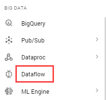
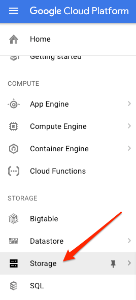
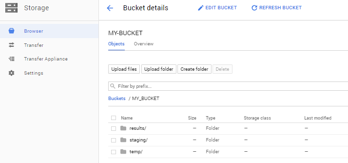

# Dataflow: Qwik Start - Python

## GSP207


In this lab you will set up your Python development environment, get the Cloud Dataflow SDK for Python, and run an example pipeline using the Google Cloud Platform Console.

---
## Setup and Requirements

### Before you click the Start Lab button

Read these instructions. Labs are timed and you cannot pause them. The timer, which starts when you click Start Lab, shows how long Cloud resources will be made available to you.

This Qwiklabs hands-on lab lets you do the lab activities yourself in a real cloud environment, not in a simulation or demo environment. It does so by giving you new, temporary credentials that you use to sign in and access the Google Cloud Platform for the duration of the lab.

### What you need

To complete this lab, you need:

* Access to a standard internet browser (Chrome browser recommended).
* Time to complete the lab.
* **Note:** If you already have your own personal GCP account or project, do not use it for this lab.

### How to start your lab and sign in to the Console

1. Click the `Start Lab` button. If you need to pay for the lab, a pop-up opens for you to select your payment method. On the left you will see a panel populated with the temporary credentials that you must use for this lab.
    
2. Copy the username, and then click `Open Google Console`. The lab spins up resources, and then opens another tab that shows the `Choose an account` page.
    * **Tip:** Open the tabs in separate windows, side-by-side.
3. On the Choose an account page, click `Use Another Account`.
    
4. The Sign in page opens. Paste the username that you copied from the Connection Details panel. Then copy and paste the password.
    * **Important:** You must use the credentials from the Connection Details panel. Do not use your Qwiklabs credentials. If you have your own GCP account, do not use it for this lab (avoids incurring charges).
5. Click through the subsequent pages:
    * Accept the terms and conditions.
    * Do not add recovery options or two-factor authentication (because this is a temporary account).
    * Do not sign up for free trials.
6. After a few moments, the GCP console opens in this tab.
    * **Note:** You can view the menu with a list of GCP Products and Services by clicking the Navigation menu at the top-left, next to “Google Cloud Platform”.
    

---
## Activate Google Cloud Shell

Google Cloud Shell is a virtual machine that is loaded with development tools. It offers a persistent 5GB home directory and runs on the Google Cloud. Google Cloud Shell provides command-line access to your GCP resources.

1. In GCP console, on the top right toolbar, click the `Open Cloud Shell` button.
    
2. In the dialog box that opens, click `START CLOUD SHELL`:
    
    * You can click `START CLOUD SHELL` immediately when the dialog box opens.
3. It takes a few moments to provision and connect to the environment. When you are connected, you are already authenticated, and the project is set to your `PROJECT_ID`. For example:
    
    * `gcloud` is the command-line tool for Google Cloud Platform. It comes pre-installed on Cloud Shell and supports tab-completion.
        * You can list the active account name with this command:
            ```bash
            $ gcloud auth list
            # Output:
            Credentialed accounts:
            - <myaccount>@<mydomain>.com (active)
            # Example output:
            Credentialed accounts:
            - google1623327_student@qwiklabs.net
            ```
        * You can list the project ID with this command:
            ```bash
            $ gcloud config list project
            # Output:
            [core]
            project = <project_ID>
            # Example output:
            [core]
            project = qwiklabs-gcp-44776a13dea667a6
            ```
    * **Note:** Full documentation of gcloud is available on [Google Cloud gcloud Overview](https://cloud.google.com/sdk/gcloud).

---
## Create a Cloud Storage bucket

1. In the GCP Console click on `Storage`.
2. Click `Create bucket`.
3. In the `Create bucket` dialog, specify the following attributes:
    * **Name**: A unique bucket name. Do not include sensitive information in the bucket name, as the bucket namespace is global and publicly visible.
    * **Storage class**: Multi-Regional
    * A location where bucket data will be stored.
4. Click `Create`.

### Install pip and the Cloud Dataflow SDK

1. The Cloud Dataflow SDK for Python requires Python version 2.7. Check that you are using Python version 2.7 by running:
    ```bash
    $ python --version
    ```
2. [Install pip](https://pip.pypa.io/en/stable/installing/), Python's package manager. Check if you already have pip installed by running:
    ```bash
    $ pip --version
    ```
3. After installation, check that you have pip version 7.0.0 or newer. To update pip, run the following command:
    ```bash
    $ sudo pip install -U pip
    ```
    * This step is optional but highly recommended. Install and create a [Python virtual environment](https://virtualenv.pypa.io/en/stable/) for initial experiments:
        * If you do not have virtualenv version 13.1.0 or newer, install it by running:
            ```bash
            $ sudo pip install --upgrade virtualenv
            ```
        * A virtual environment is a directory tree containing its own Python distribution. To create a virtual environment, run the following:
            ```bash
            $ virtualenv -p python2.7 env
            ```
        * A virtual environment needs to be activated for each shell that will use it. Activating it sets some environment variables that point to the virtual environment's directories. To activate a virtual environment in Bash, run:
            ```bash
            $ source env/bin/activate
            ```
            * This command sources the script bin/activate under the virtual environment directory you created. For instructions using other shells, see the [virtualenv](https://virtualenv.pypa.io/en/stable/userguide/#activate-script) documentation.
4. Install the latest version of the Apache Beam for Python by running the following command from a virtual environment:
    ```bash
    $ pip install apache-beam[gcp]
    ```
    * You will see some warnings returned that are related to dependencies. It is safe to ignore them for this lab.
5. Run the `wordcount.py` example locally by running the following command:
    ```bash
    $ python -m apache_beam.examples.wordcount --output OUTPUT_FILE
    ```
    * **Note:** You installed `google-cloud-dataflow` but are executing `wordcount` with `apache_beam`. The reason for this is that Cloud Dataflow is a distribution of [Apache Beam](https://github.com/apache/beam)
    * You may see a message similar to the following:
        ```bash
        INFO:root:Missing pipeline option (runner). Executing pipeline using the default runner: DirectRunner.
INFO:oauth2client.client:Attempting refresh to obtain initial access_token
        ```
        * This message can be ignored.
    * You can now list the files that are on your local cloud environment to get the name of the `OUTPUT_FILE`:
        ```bash
        $ ls
        ```
    * Copy the name of the `OUTPUT_FILE` and `cat` into it:
        ```bash
        $ cat <filename>
        ```
    * Your results show each word in the file and how many times it appears.

### Run an Example Pipeline Remotely

1. Set the `BUCKET` environment variable to the bucket you created earlier.
    ```bash
    $ BUCKET=gs://<bucket name provided earlier>
    ```
2. Now you'll run the `wordcount.py` example remotely:
    ```bash
    $ python -m apache_beam.examples.wordcount --project $DEVSHELL_PROJECT_ID \
    --runner DataflowRunner \
    --staging_location $BUCKET/staging \
    --temp_location $BUCKET/temp \
    --output $BUCKET/results/output
    ```
    * In your output, wait until you see the message:
        ```bash
        JOB_MESSAGE_DETAILED: Workers have started successfully.
        ```

---
## Check that your job succeeded

1. Open the Cloud Dataflow.
    
    * You should see your **wordcount** job with a **status** of **Running** at first.
2. Click on the name to watch the process. When all the boxes are checked off, you can continue watching the logs in Cloud Shell.
3. The process is complete when the status is **Succeeded**:
    
4. Click on `Storage` in the Console.
    
5. Click on the name of your bucket. In your bucket, you should see the `results` and `staging` directories:
    
6. Click on the `results` folder and you should see the output files that your job created:
    
7. Click on a file to see the word counts it contains.

---
## Test your Understanding

Below are a multiple choice questions to reinforce your understanding of this lab's concepts. Answer them to the best of your abilities.

* T: (T/F) Dataflow temp_location must be a valid Google Cloud Storage URL.

---
## Congratulations!

### Finish Your Quest

Continue your Quest with [Baseline: Data, ML, AI](https://google.qwiklabs.com/quests/34). A Quest is a series of related labs that form a learning path. Completing this Quest earns you the badge above, to recognize your achievement. You can make your badge (or badges) public and link to them in your online resume or social media account. [Enroll in this Quest](https://google.qwiklabs.com/learning_paths/34/enroll) and get immediate completion credit if you've taken this lab. [See other available Qwiklabs Quests](http://google.qwiklabs.com/catalog).

### Next Steps / Learn More

This lab is part of a series of labs called Qwik Starts. These labs are designed to give you a little taste of the many features available with Google Cloud. Search for "Qwik Starts" in the [lab catalog](https://google.qwiklabs.com/catalog) to find the next lab you'd like to take!