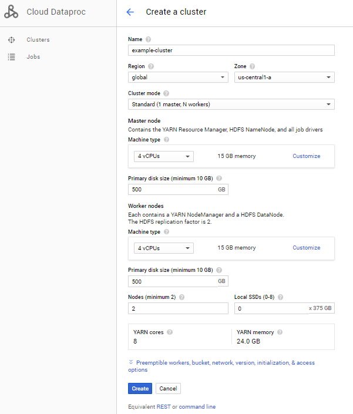
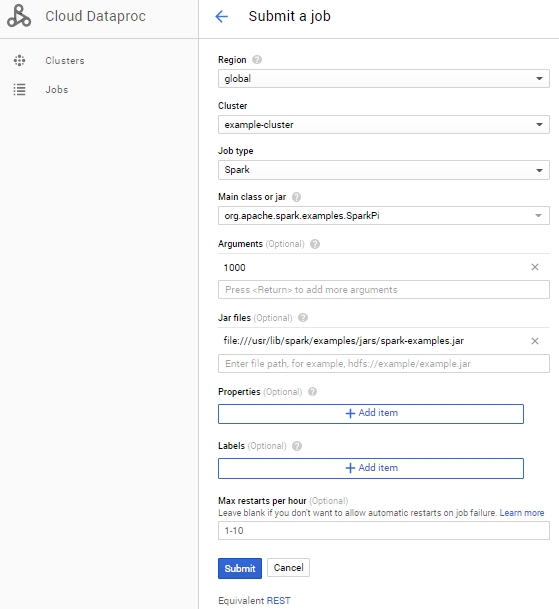
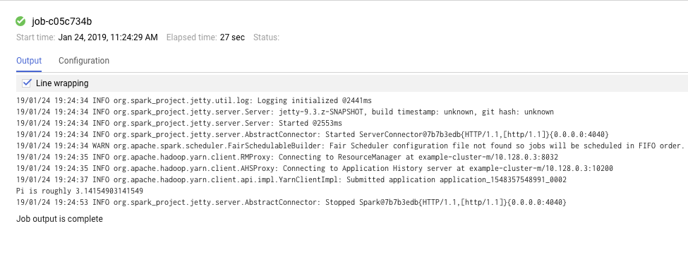
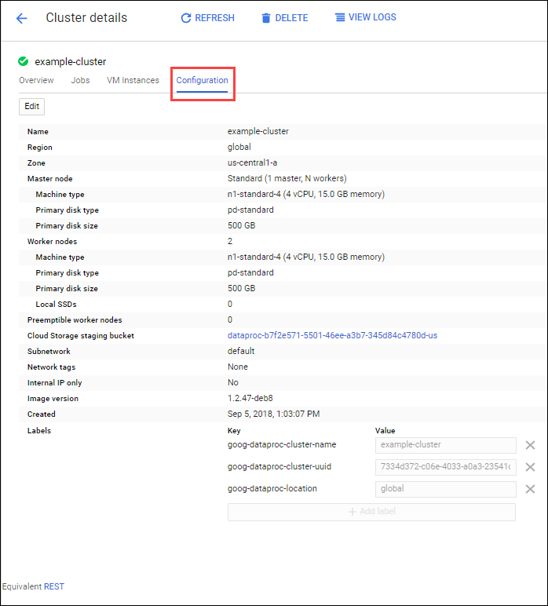
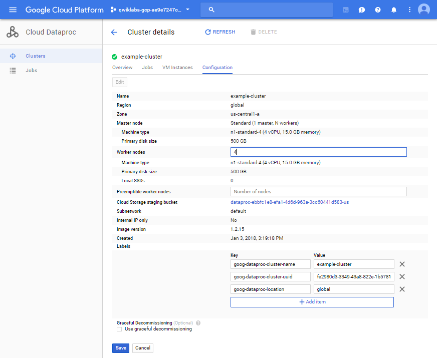
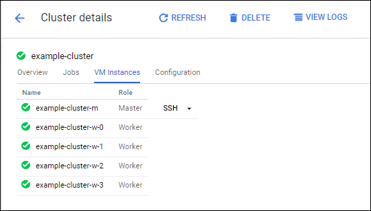

# Dataproc: Qwik Start - Console

## GSP103

Cloud Dataproc is a fast, easy-to-use, fully-managed cloud service for running [Apache Spark](http://spark.apache.org/) and [Apache Hadoop](http://hadoop.apache.org/) clusters in a simpler, more cost-efficient way. Operations that used to take hours or days take seconds or minutes instead. Create Cloud Dataproc clusters quickly and resize them at any time, so you don't have to worry about your data pipelines outgrowing your clusters.

This lab shows you how to use the Google Cloud Platform (GCP) Console to create a Google Cloud Dataproc cluster, run a simple [Apache Spark](http://spark.apache.org/) job in the cluster, then modify the number of workers in the cluster.

---
## Setup and Requirements

### Before you click the Start Lab button

Read these instructions. Labs are timed and you cannot pause them. The timer, which starts when you click Start Lab, shows how long Cloud resources will be made available to you.

This Qwiklabs hands-on lab lets you do the lab activities yourself in a real cloud environment, not in a simulation or demo environment. It does so by giving you new, temporary credentials that you use to sign in and access the Google Cloud Platform for the duration of the lab.

### What you need

To complete this lab, you need:

* Access to a standard internet browser (Chrome browser recommended).
* Time to complete the lab.
* **Note:** If you already have your own personal GCP account or project, do not use it for this lab.

### How to start your lab and sign in to the Console

1. Click the `Start Lab` button. If you need to pay for the lab, a pop-up opens for you to select your payment method. On the left you will see a panel populated with the temporary credentials that you must use for this lab.
    
2. Copy the username, and then click `Open Google Console`. The lab spins up resources, and then opens another tab that shows the `Choose an account` page.
    * **Tip:** Open the tabs in separate windows, side-by-side.
3. On the Choose an account page, click `Use Another Account`.
    
4. The Sign in page opens. Paste the username that you copied from the Connection Details panel. Then copy and paste the password.
    * **Important:** You must use the credentials from the Connection Details panel. Do not use your Qwiklabs credentials. If you have your own GCP account, do not use it for this lab (avoids incurring charges).
5. Click through the subsequent pages:
    * Accept the terms and conditions.
    * Do not add recovery options or two-factor authentication (because this is a temporary account).
    * Do not sign up for free trials.
6. After a few moments, the GCP console opens in this tab.
    * **Note:** You can view the menu with a list of GCP Products and Services by clicking the Navigation menu at the top-left, next to “Google Cloud Platform”.
    

### Confirm Cloud Dataproc API is enabled

To create a Dataproc cluster in GCP, the Cloud Dataproc API must be enabled. To confirm the API is enabled:

1. Click `Navigation menu > APIs & Services > Library`:
    
2. Type Cloud Dataproc in the Search for APIs & Services dialog. The console will display the Cloud Dataproc API in the search results.
3. Click on `Cloud Dataproc API` to display the status of the API. If the API is not already enabled, click the `Enable` button.
    * If the API's enabled, you're good to go:
        

---
## Create a cluster

1. In the Cloud Platform Console, select `Navigation menu > Dataproc > Clusters`, then click `Create cluster`.
2. Set the following fields for your cluster. Accept the default values for all other fields.
    | Field | Value |
    |---|---|
    | Name | `example-cluster` |
    | Region | `global` |
    | Zone | `us-central1-a` |
    * **Note:** A Zone is a special multi-region namespace that is capable of deploying instances into all Google Compute zones globally. You can also specify distinct regions, such as `us-east1` or `europe-west1`, to isolate resources (including VM instances and Google Cloud Storage) and metadata storage locations utilized by Cloud Dataproc within the user-specified region.
3. Click `Create` to create the cluster.
    
    * Your new cluster will appear in the Clusters list. It may take a few minutes to create, the cluster Status shows as **Provisioning** until the cluster is ready to use, then changes to **Running**.

---
## Submit a job

To run a sample Spark job:

1. Click `Jobs` in the left pane to switch to Dataproc's jobs view, then click `Submit job`:
    
2. Set the following fields to update Job. Accept the default values for all other fields.
    | Field | Value |
    |---|---|
    | Cluster | `example-cluster` |
    | Job type | `Spark` |
    | Main class or jar | `org.apache.spark.examples.SparkPi` |
    | Arguments | `1000` (This sets the number of tasks.) |
    | Jar file | `file:///usr/lib/spark/examples/jars/spark-examples.jar` |
3. Click Submit.
    

> **How the job calculates Pi:** The Spark job estimates a value of Pi using the [Monte Carlo method](https://en.wikipedia.org/wiki/Monte_Carlo_method). It generates x,y points on a coordinate plane that models a circle enclosed by a unit square. The input argument (1000) determines the number of x,y pairs to generate; the more pairs generated, the greater the accuracy of the estimation. This estimation leverages Cloud Dataproc worker nodes to parallelize the computation. For more information, see [Estimating Pi using the Monte Carlo Method](https://academo.org/demos/estimating-pi-monte-carlo/) and see [JavaSparkPi.java on GitHub](https://github.com/apache/spark/blob/master/examples/src/main/java/org/apache/spark/examples/JavaSparkPi.java).

4. Your job should appear in the `Jobs` list, which shows your project's jobs with its cluster, type, and current status. Job status displays as **Running**, and then **Succeeded** after it completes.
    

---
## View the job output

To see your completed job's output:

1. Click the job ID in the `Jobs` list.
2. Check `Line wrapping` or scroll all the way to the right to see the calculated value of Pi. Your output, with `Line wrapping` checked, should look something like this:
    
3. Your job has successfully calculated a rough value for pi!

### Update a cluster

To change the number of worker instances in your cluster:

1. Select `Clusters` in the left navigation pane to return to the Dataproc Clusters view.
2. Click `example-cluster` in the `Clusters` list. By default, the page displays an overview of your cluster's CPU usage.
3. Click `Configuration` to display your cluster's current settings.
    
4. Click `Edit`. The number of worker nodes is now editable.
5. Enter `4` in the `Worker nodes` field.
6. Click `Save`.
    
7. Your cluster is now updated. Check out the number of `VM instances` in the cluster:
    
8. To rerun the job with the updated cluster, you would click `Jobs` in the left pane, then click `SUBMIT JOB`.
9. Set the same fields you set in the `Submit a job` section:
    | Field | Value |
    |---|---|
    | Cluster | `example-cluster` |
    | Job type | `Spark` |
    | Main class or jar | `org.apache.spark.examples.SparkPi` |
    | Arguments | `1000` (This sets the number of tasks.) |
    | Jar file | `file:///usr/lib/spark/examples/jars/spark-examples.jar` |
10. Click `Submit`.
    

---
## Test your Understanding

Below are multiple-choice questions to reinforce your understanding of this lab's concepts. Answer them to the best of your abilities.

* 3: Which type of Dataproc job is submitted in the lab?
    1. SparkSql
    2. Pig
    3. Spark
    4. PySpark
    5. Hadoop
* T: (T/F) Dataproc helps users process, transform and understand vast quantities of data.

---
## Congratulations!

Now you know how to use the Google Cloud Platform Console to create and update a Dataproc cluster and then submit a job in that cluster.

### Finish Your Quest

Continue your Quest with [Baseline: Data, ML, AI](https://google.qwiklabs.com/quests/34). A Quest is a series of related labs that form a learning path. Completing this Quest earns you the badge above, to recognize your achievement. You can make your badge (or badges) public and link to them in your online resume or social media account. [Enroll in this Quest](https://google.qwiklabs.com/learning_paths/34/enroll) and get immediate completion credit if you've taken this lab. [See other available Qwiklabs Quests](http://google.qwiklabs.com/catalog).

### Next Steps / Learn More

This lab is part of a series of labs called Qwik Starts. These labs are designed to give you a little taste of the many features available with Google Cloud. Search for "Qwik Starts" in the [lab catalog](https://google.qwiklabs.com/catalog) to find the next lab you'd like to take!

---
## Student Resources

* [Dataproc: Qwik Start - Qwiklabs Preview](https://youtu.be/UOX9G6ArJRc)
* [Run Spark and Hadoop Faster with Cloud Dataproc](https://youtu.be/h1LvACJWjKc)
