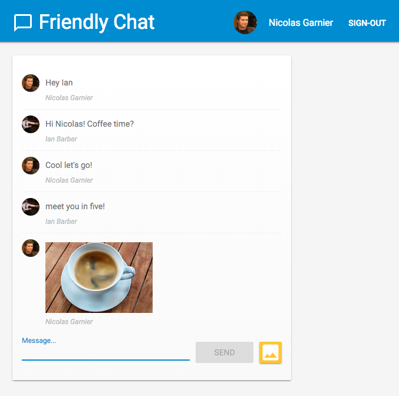
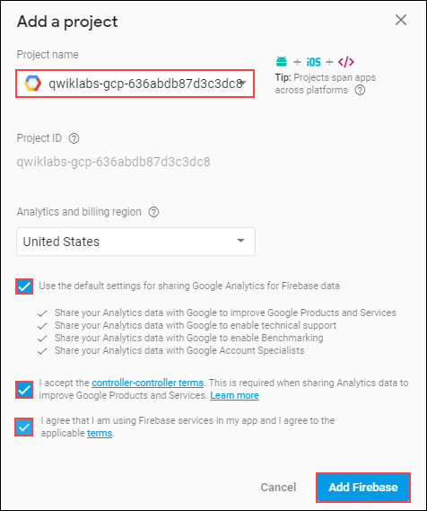
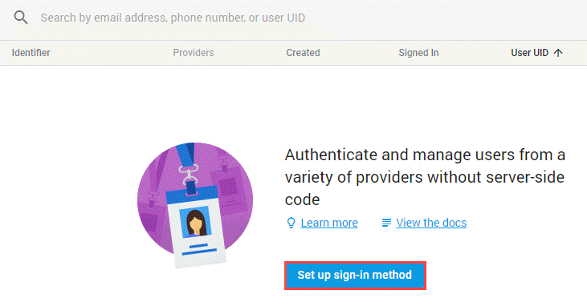
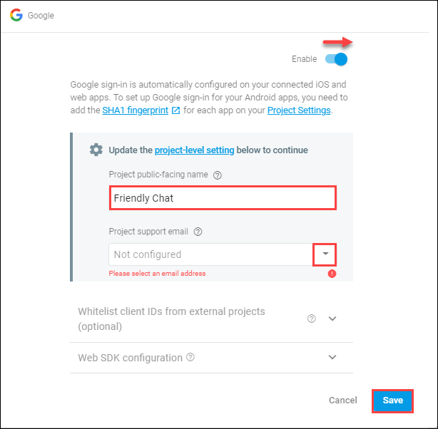
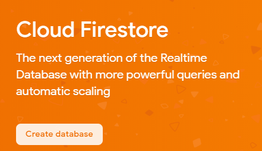
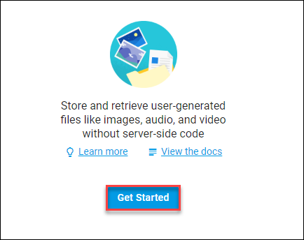
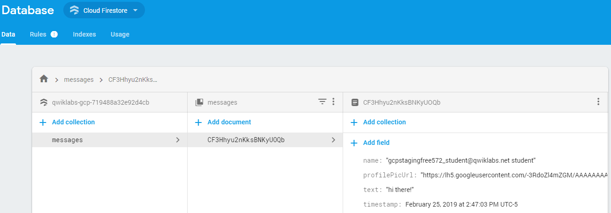
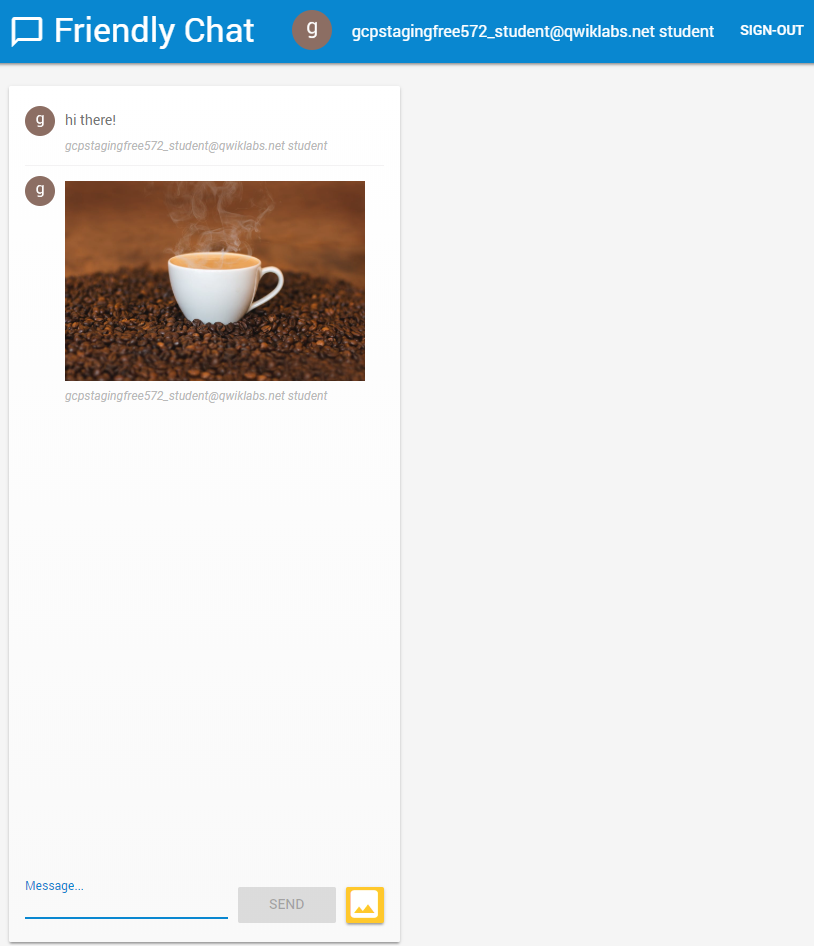

# Firebase Web

## GSP065


In this lab you will learn how to use [Firebase](http://firebase.google.com/) to easily create web applications by implementing and deploying a chat client using Firebase products and services.



### What you'll learn

In this lab, you will learn how to:

* Sync data using the Cloud Firestore and Cloud Storage for Firebase.
* Authenticate your users using Firebase Auth.
* Deploy your web app on Firebase Hosting.
* Send notifications with Firebase Cloud Messaging.

---
## Setup and Requirements

### Before you click the Start Lab button

Read these instructions. Labs are timed and you cannot pause them. The timer, which starts when you click Start Lab, shows how long Cloud resources will be made available to you.

This Qwiklabs hands-on lab lets you do the lab activities yourself in a real cloud environment, not in a simulation or demo environment. It does so by giving you new, temporary credentials that you use to sign in and access the Google Cloud Platform for the duration of the lab.

### What you need

To complete this lab, you need:

* Access to a standard internet browser (Chrome browser recommended).
* Time to complete the lab.
* **Note:** If you already have your own personal GCP account or project, do not use it for this lab.

### How to start your lab and sign in to the Console

1. Click the `Start Lab` button. If you need to pay for the lab, a pop-up opens for you to select your payment method. On the left you will see a panel populated with the temporary credentials that you must use for this lab.
    
2. Copy the username, and then click `Open Google Console`. The lab spins up resources, and then opens another tab that shows the **Choose an account** page.
    * **Tip:** Open the tabs in separate windows, side-by-side.
3. On the Choose an account page, click `Use Another Account`.
    
4. The Sign in page opens. Paste the username that you copied from the Connection Details panel. Then copy and paste the password.
    * **Important:** You must use the credentials from the Connection Details panel. Do not use your Qwiklabs credentials. If you have your own GCP account, do not use it for this lab (avoids incurring charges).
5. Click through the subsequent pages:
    * Accept the terms and conditions.
    * Do not add recovery options or two-factor authentication (because this is a temporary account).
    * Do not sign up for free trials.
6. After a few moments, the GCP console opens in this tab.
    * **Note:** You can view the menu with a list of GCP Products and Services by clicking the Navigation menu at the top-left, next to “Google Cloud Platform”.
    

---
## Activate Google Cloud Shell

Google Cloud Shell is a virtual machine that is loaded with development tools. It offers a persistent 5GB home directory and runs on the Google Cloud. Google Cloud Shell provides command-line access to your GCP resources.

1. In GCP console, on the top right toolbar, click the `Open Cloud Shell` button.
    
2. In the dialog box that opens, click `START CLOUD SHELL`:
    
    * **Note:** You can click `START CLOUD SHELL` immediately when the dialog box opens.
3. It takes a few moments to provision and connect to the environment. When you are connected, you are already authenticated, and the project is set to your `PROJECT_ID`. For example:
    
    * `gcloud` is the command-line tool for Google Cloud Platform. It comes pre-installed on Cloud Shell and supports tab-completion.
        * You can list the active account name with this command:
            ```bash
            $ gcloud auth list
            # Output:
            Credentialed accounts:
            - <myaccount>@<mydomain>.com (active)
            # Example output:
            Credentialed accounts:
            - google1623327_student@qwiklabs.net
            ```
        * You can list the project ID with this command:
            ```bash
            $ gcloud config list project
            # Output:
            [core]
            project = <project_ID>
            # Example output:
            [core]
            project = qwiklabs-gcp-44776a13dea667a6
            ```
    * **Note:** Full documentation of `gcloud` is available on [Google Cloud gcloud Overview](https://cloud.google.com/sdk/gcloud).

---
## Get the sample code

1. In Cloud Shell command line, clone the [GitHub repository](https://github.com/firebase/friendlychat-web):
    ```bash
    $ git clone https://github.com/firebase/friendlychat-web
    ```
    * The `friendlychat-web` repository contains sample projects for multiple platforms. This lab uses only two repositories:
        * `web-start`: The starting code that you'll build upon in this lab.
        * `web`: The complete code for the finished sample app.
    * Note: If you want to just run the finished app, you still have to create a project in the Firebase console. See the **Create a Firebase project and set up your app** section for instructions.

---
## View the starter application

Throughout this lab you will be modifying files in the `friendlychat-web` directory. You can use text editors that come pre-installed in Cloud Shell (like `nano` or `vim`), but this lab will use the Cloud Shell code editor.

1. To view `friendlychat-web`, click the `Code Editor` icon:
    
2. This opens a new browser window with the Cloud Shell tab.
    * The `friendlychat-web/web-start` directory contains the starting code for this lab, which consists of a fully functional Chat Web App.
3. Navigate to `friendlychat-web/web-start` in the left pane to view the application files and code in the right pane. In this lab, navigation is relative to `friendlychat-web/web-start`.

---
## Set up your Firebase project

Now that your files are opened up in the Cloud Shell code editor, get Firebase set up. The application you build in this lab uses the whole set of Firebase products available on the web:

* **Firebase Authentication** to easily let your users sign-in your app.
* **Cloud Firestore** to save structured data on the Cloud and get instant notification when the data is updated.
* **Cloud Storage** for Firebase to save files in the cloud.
* **Firebase Hosting** to host and serve your static assets.
* **Firebase Cloud Messaging** to send push notifications and display browser popup notifications.

### Enable Firebase on your project

1. Open the Firebase console in a new tab with [this link](https://console.firebase.google.com/), then click `Add project`.
    
2. In the Project Name dropdown menu select your Qwiklabs project and check the boxes to accept the default settings and terms. Click `Add Firebase`:
    

### Enable Google sign-in for Firebase Authentication

Now you will enable Google Authentication to allow users to sign in to the web app with their Google accounts.

1. Click the `Auth` tile, then `Set up sign-in method`.
    
    * Now mouse over Google in the `Sign-in Providers` section, then click the pencil.
    * Move the toggle to `Enable`.
    * Give the project the public-facing name `"Friendly Chat"`.
    * Select your GCP Username from the `Project support email` dropdown.
    * Then click `Save`.
        
2. Now a user can sign into the app with their Google account credentials.

### Enable Cloud Firestore

The app uses [Cloud Firestore](https://firebase.google.com/docs/firestore/) to save the chat messages and receive new chat messages.

1. To enable Cloud Firestore on your Firebase project, select `Database` from the left menu, then click `Create database` under Cloud Firestore.
    
2. Select the `Start in test mode` option, then `Enable`.

### Enable Cloud Storage

1. The app uses Cloud Storage for Firebase to store, upload, and share pictures. To enable Cloud Storage on your Firebase project, select `Storage` from the left hand Develop menu and click `Get Started`.
    
2. Click `Got It` after you read the disclaimer about the security rules. With the default security rules, any authenticated users can write to anything to Cloud Storage. You'll make this more secure later.

---
## Install the Firebase command line interface

Cloud Shell comes with the `firebase` command line interface (CLI) already installed.

1. In Cloud Shell, check what version of Firebase is installed with the following command:
    ```bash
    $ firebase --version
    ```
    * The output should show a version above 6.0.0
2. Authorize the Firebase CLI:
    ```bash
    $ Authorize the Firebase CLI:
    ```
    * The `--no-localhost` option is used because you are on a remote shell.
3. When asked if you should **Allow Firebase to collect anonymous CLI usage and error reporting information**, type `"Y"`.
4. Copy the link in the output into a new tab. **Do not click the link!** Select your lab username, then click `Allow`.
5. Copy the verification code from the browser and enter it in the Cloud Shell prompt.
6. Still in Cloud Shell command line, navigate to `friendlychat-web > web-start` directory by running:
    ```bash
    $ cd ~/friendlychat-web/web-start/
    ```
7. Now set up the Firebase CLI to use your Firebase Project:
    ```bash
    $ firebase use --add
    ```
8. You'll be asked which project to add. Press `ENTER` to select your `Project ID` and follow the instructions. When prompted, create an alias, such as `staging`.

> **Note:** Giving your project an alias is helpful if you are managing multiple `apps/projects`. You can switch between aliases in Cloud Shell with firebase use `<alias_name>`.

---
## Deploy and run the starter app

Now that you have imported and configured your project you are ready to run the app for the first time.

1. In Cloud Shell run the following command:
    ```bash
    $ firebase serve --only hosting
    # Example output:
    i  hosting: Serving hosting files from: ./
    ✔  hosting: Local server: http://localhost:5000
    ```
2. You're using the Firebase hosting emulator to serve the application locally. The web app should now be available from `http://localhost:5000`. Click the URL in your output to open it. You should see your app's not (yet!) functioning UI:
    
    * Stop the app by pressing `CTRL + C`. This lab has laid out only the UI for you so far. Now you will build a realtime chat!

---
## Import and Configure Firebase

### Import the Firebase SDK

In a production environment the Firebase SDK must be imported into your application. There are multiple ways to do this that are described in [the documentation](https://firebase.google.com/docs/web/setup).

For this lab, the local URLs and project have already been added to the bottom of the `index.html` file.

1. In the Cloud Shell code editor, navigate to `friendlychat-web > web-start > public` and open the `index.html` to check it out. You will be editing this file soon.
2. Since this lab uses Firebase Hosting to serve the application, the local URLs are imported in the `index.html`. You can scroll to the bottom of the file and look for them.
    ```html
    <script src="/__/firebase/5.7.3/firebase-app.js"></script>
    <script src="/__/firebase/5.7.3/firebase-auth.js"></script>
    <script src="/__/firebase/5.7.3/firebase-storage.js"></script>
    <script src="/__/firebase/5.7.3/firebase-messaging.js"></script>
    <script src="/__/firebase/5.7.3/firebase-firestore.js"></script>
    ```
3. You also need to tell the Firebase SDK which project you're using. A special script is also imported to do that.
    ```html
    <script src="/__/firebase/init.js"></script>
    ```

During this lab, you’re going to use Firebase Auth, Cloud Firestore, Cloud Storage, and Cloud Messaging, so you’re importing all of their libraries. In your future apps, make sure that you’re only importing the parts of Firebase that you need in order to shorten the load time of your app.

---
## Set up user sign in

The Firebase SDK was imported and initialized in the `index.html` file, so it's ready to use. Next, implement user sign in using Firebase Auth.

### Authenticate your users with Google Sign-In

When the user clicks the `Sign in with Google` button, the `signIn` function is triggered (this is already set up for you). Authorize Firebase to use Google as the Identity Provider. Users will sign in using a popup.

1. In the code editor, navigate to `scripts/main.js` and update the `signIn` function with the following information:
    ```js
    // Signs-in Friendly Chat.
    function signIn() {
        // Sign into Firebase using popup auth & Google as the identity provider.
        var provider = new firebase.auth.GoogleAuthProvider();
        firebase.auth().signInWithPopup(provider);
    }
    ```
2. The `signOut` function is triggered when the user clicks `Sign out`. Update the `signOut` function with:
    ```js
    // Signs-out of Friendly Chat.
    function signOut() {
        // Sign out of Firebase.
        firebase.auth().signOut();
    }
    ```

### Track the auth state

You need a way to check if the user is signed in or signed out. With Firebase Auth, you can register an observer on the authentication state which will be triggered each time the auth state changes.

1. Still in `scripts/main.js`, update the `initFirebaseAuth` function:
    ```js
    // Initiate Firebase Auth.
    function initFirebaseAuth() {
        // Listen to auth state changes.
        firebase.auth().onAuthStateChanged(authStateObserver);
    }
    ```
2. This registers the function authStateObserver as the observer. It triggers every time there is a change in the auth state - when the user signs in or signs out. This function updates the UI to display or hide the `Sign-in` button, the `Sign-out` button, and the signed in user's profile picture.

### Display the signed in user information

In Firebase, the signed in user's data is always available in the `firebase.auth().currentUser` object. The `authStateObserver` function will call the `getProfilePicUrl` and `getUserName` when triggered.

1. To display the users name and profile picture, in `scripts/main.js` update the profile pic and display name functions to:
    ```js
    // Returns the signed-in user's profile pic URL.
    function getProfilePicUrl() {
        return firebase.auth().currentUser.photoURL || '/images/profile_placeholder.png';
    }

    // Returns the signed-in user's display name.
    function getUserName() {
        return firebase.auth().currentUser.displayName;
    }
    ```
2. If the user tries to send a messages when they are not signed in, the app should display an error message. To detect if the user is actually signed in, change the `isUserSignedIn` function to:
    ```js
    // Returns true if a user is signed-in.
    function isUserSignedIn() {
        return !!firebase.auth().currentUser;
    }
    ```
3. Save `scripts/main.js`.

### Test signing-in to the app

1. Redeploy your app by running:
    ```bash
    $ firebase deploy --except functions
    ```
2. Click on the Hosting URL that is returned to open the application in your browser.
3. Sign in using the `Sign-In with Google` button. Remember to use your Qwiklabs credentials!
4. After Signing in the profile pic and name of the user will be displayed:
    

---
## Write messages to Cloud Firestore

Next you'll write some data to Cloud Firestore so that you can populate the app's UI. This can be done manually in the Firebase console, but for this lab you'll do it in the app itself to demonstrate basic Cloud Firestore write.

### Data Model

Firestore data is split into collections, documents, fields, and subcollections. Each message of the chat is stored as a document in a top-level collection called `messages`.

### Add messages to Firestore

In this section, you’ll add the functionality to let users write new messages to Cloud Firestore. A user clicking the `SEND` button will trigger the code snippet below. It adds a message object with the contents of the message fields to your Firestore instance in the `messages` collection. The `add()` method adds a new document with an automatically generated ID to the collection.

1. Go back to the file `public/scripts/main.js`. Find the function saveMessage. Replace the entire function with the following code:
    ```js
    // Saves a new message on the Cloud Firestore.
    function saveMessage(messageText) {
        // Add a new message entry to the Firebase database.
        return firebase.firestore().collection('messages').add({
            name: getUserName(),
            text: messageText,
            profilePicUrl: getProfilePicUrl(),
            timestamp: firebase.firestore.FieldValue.serverTimestamp()
        }).catch(function(error) {
            console.error('Error writing new message to Firebase Database', error);
        });
    }
    ```

### Test sending messages

1. Redeploy your app by running:
    ```bash
    $ firebase deploy --except functions
    ```
2. Click on the Hosting URL that is returned to open the application in your browser.
3. After signing-in, enter a message such as `“Hi there!”`, then click `SEND`. This will write the message into Firestore. However, you won't yet see the data in your actual web app because you still need to implement retrieving the data (the next section of the lab).
4. You can see the newly added message in your Firebase Console. In the Develop section click on `Database` and you should see the messages collection with your newly added message:
    

---
## Read messages

### Synchronize Messages

To read messages on the application, add listeners that trigger when changes are made to the data then creates a UI element that shows new messages.

1. In `scripts/main.js`, update the `loadMessages` function:
    ```js
    // Loads chat messages history and listens for upcoming ones.
    function loadMessages() {
        // Create the query to load the last 12 messages and listen for new ones.
        var query = firebase.firestore()
                        .collection('messages')
                        .orderBy('timestamp', 'desc')
                        .limit(12);

        // Start listening to the query.
        query.onSnapshot(function(snapshot) {
            snapshot.docChanges().forEach(function(change) {
            if (change.type === 'removed') {
                deleteMessage(change.doc.id);
            } else {
                var message = change.doc.data();
                displayMessage(change.doc.id, message.timestamp, message.name,
                            message.text, message.profilePicUrl, message.imageUrl);
            }
            });
        });
    }
    ```
2. To listen to messages in the database, you create a query on a collection by using the `.collection` function to specify in which collection is the data you want to listen to. Above, you're listening to the changes under the `messages` collection, which is where the messages are stored. You're also applying a limit and only listening to the last 12 messages using `.limitToLast(12)` and ordering the messages by date using `.orderBy('timestamp','desc')` to get the 12 newest messages.
3. The `.onSnapshot` function takes one parameter: a callback function. The callback function will be triggered when there are any changes to documents that match the query. This could be if a message gets deleted, or modified, or added.

### Test message sync

1. Redeploy your app by running:
    ```bash
    $ firebase deploy --except functions
    ```
2. Click on the Hosting URL that is returned to open the application in your browser or refresh the Friendly Chat tab you're already signed into.
3. The messages you typed earlier and saw in the database should be displayed in the Friendly Chat UI. You can also write a new message, it should appear instantly. You can also try manually deleting, modifying, or adding new messages directly in the `Database` section of the Firebase Console, the changes should reflect in the UI.
    

Congratulations, you are reading database entries in your app!

---
## Send Images

Now add a feature that shares images.

While the Cloud Firestore is good to store structured data, files are better stored in Cloud Storage. [Cloud Storage for Firebase](https://firebase.google.com/docs/storage/) is a file/blob storage service. Use it to store the images the user shares.

### Save images to Cloud Storage

There's already a button in the UI that triggers a file picker dialog. After selecting an image file, the `saveImageMessage` function is triggered and you get a reference to the selected file. You'll add code to the file that:

* Creates a `"placeholder"` chat message into the chat feed, so that users see a "Loading" animation while we upload the image.
* Upload the image file to Cloud Storage to the path: `/<uid>/<messageId>/<file_name>`.
* Generate a publicly readable URL for the image file.
* Update the chat message with the newly uploaded image file's URL in lieu of the temporary loading image.

1. Now actually add the funtionality. In `scripts/main.js`, modify the `saveImageMessage` function to the following:
    ```js
    // Saves a new message containing an image in Firebase.
    // This first saves the image in Firebase storage.
    function saveImageMessage(file) {
        // 1 - We add a message with a loading icon that will get updated with the shared image.
        firebase.firestore().collection('messages').add({
            name: getUserName(),
            imageUrl: LOADING_IMAGE_URL,
            profilePicUrl: getProfilePicUrl(),
            timestamp: firebase.firestore.FieldValue.serverTimestamp()
        }).then(function(messageRef) {
            // 2 - Upload the image to Cloud Storage.
            var filePath = firebase.auth().currentUser.uid + '/' + messageRef.id + '/' + file.name;
            return firebase.storage().ref(filePath).put(file).then(function(fileSnapshot) {
            // 3 - Generate a public URL for the file.
            return fileSnapshot.ref.getDownloadURL().then((url) => {
                // 4 - Update the chat message placeholder with the image’s URL.
                return messageRef.update({
                imageUrl: url,
                storageUri: fileSnapshot.metadata.fullPath
                });
            });
            });
        }).catch(function(error) {
            console.error('There was an error uploading a file to Cloud Storage:', error);
        });
    }
    ```

### Test sending images

1. Redeploy your app:
    ```bash
    $ firebase deploy --except functions
    ```
2. Open the hosting URL, or refresh your app.
3. Click the `Image Upload` button and select an image file from your computer using the file picker. If you’re looking for an image, feel free to use this nice pic of a [coffee cup](https://www.pexels.com/photo/aroma-aromatic-art-artistic-434213/).
4. A new message should be visible in the app UI with your selected image:
    

If you try adding an image while not signed in, you will see a Toast telling you that you must sign in to add images.

---
## Show Notifications

Now add support for browser notifications so users receive a notification when a new message has been posted in the chat. [Firebase Cloud Messaging (FCM)](https://firebase.google.com/docs/cloud-messaging/) is a cross-platform messaging solution that lets you reliably deliver messages and notifications at no cost.

### Whitelist the GCM Sender ID

In the [web app manifest](https://developers.google.com/web/fundamentals/engage-and-retain/web-app-manifest/), specify the `gcm_sender_id`, a hard-coded value,and indicate that FCM is authorized to send messages to this app.

1. Friendly Chat already has a `manifest.json` configuration file. In the Cloud Shell code editor, navigate to `friendlychat-web > web-start > public` and open the `manifest.json` file. Update the browser sender ID exactly as shown (do not change the value):
    ```json
    {
        "name": "Friendly Chat",
        "short_name": "Friendly Chat",
        "start_url": "/index.html",
        "display": "standalone",
        "orientation": "portrait",
        "gcm_sender_id": "103953800507"
    }
    ```

### Add the FCM service worker

The web app needs a [Service Worker](https://developer.mozilla.org/en/docs/Web/API/Service_Worker_API) that receives and displays web notifications.

1. While you're in the code editor, create a new service worker file named `firebase-messaging-sw.js` in the `public` folder with the following content:
    ```js
    importScripts('/__/firebase/5.6.0/firebase-app.js');
    importScripts('/__/firebase/5.6.0/firebase-messaging.js');
    importScripts('/__/firebase/init.js');

    firebase.messaging();
    ```
2. The service worker needs to load and initialize the Firebase Cloud Messaging SDK, which will take care of displaying notifications.

### Get FCM device tokens

When notifications are enabled on a device or browser, you'll be given a **device token**. This device token is used to send a notification to a particular device or browser.

When the user signs in, the `saveMessagingDeviceToken` function is called. That's where you'll get the FCM device token and save it to the Cloud Firestore.

1. In `scripts/main.js`, update the `saveMessagingDeviceToken` function with the following:
    ```js
    // Saves the messaging device token to the datastore.
    function saveMessagingDeviceToken() {
        firebase.messaging().getToken().then(function(currentToken) {
            if (currentToken) {
            console.log('Got FCM device token:', currentToken);
            // Saving the Device Token to the datastore.
            firebase.firestore().collection('fcmTokens').doc(currentToken)
                .set({uid: firebase.auth().currentUser.uid});
            } else {
            // Need to request permissions to show notifications.
            requestNotificationsPermissions();
            }
        }).catch(function(error){
            console.error('Unable to get messaging token.', error);
        });
    }
    ```
2. Save the file.

For your app to be able to retrieve the device token, the user needs to grant your app permission to show notifications. You'll set that up next.

### Request permissions to show notifications

1. To show notifications the user must give permission by calling the `firebase.messaging().requestPermission()` method, which will display a browser dialog asking for this permission in [supported browsers](https://caniuse.com/#feat=push-api):
    
2. In `scripts/main.js`, update the `requestNotificationsPermissions` function:
    ```js
    // Requests permission to show notifications.
    function requestNotificationsPermissions() {
        console.log('Requesting notifications permission...');
        firebase.messaging().requestPermission().then(function() {
            // Notification permission granted.
            saveMessagingDeviceToken();
        }).catch(function(error) {
            console.error('Unable to get permission to notify.', error);
        });
    }
    ```
3. Save the file.

### Get your Device token

> **Note:** If you are using Chrome, open this application in a browser window that is **NOT** incognito or guest mode. You won't be able to see the notifications permission dialog if you are.

1. Redeploy your app:
    ```bash
    $ firebase deploy --except functions
    ```
2. Click on the URL to open the application in your browser, or paste the URL into a new browser (not icongnito or guest mode).
3. After signing in, you should see the Notifications permission dialog being displayed:
    
    * Click `Allow`.
4. Open the JavaScript console of your browser (If you are using Chrome, go to `More Tools > Developer Tools > Console`.) You should see a message that reads:
    ```bash
    Got FCM device token: cWL6w:APA91bHP...4jDPL_A-wPP06GJp1OuekTaTZI5K2Tu
    ```
5. Copy and save your device token, you will need it for the next step.

### Send a notification to your device

1. For the app to send a notification it needs to have your device token and the Firebase app's `Server Key`. Find the server key in the Firebase Console: `Project Settings > Cloud Messaging`. Copy the Server Key and save it.
2. To send a notification the app needs the following HTTP request:
    ```
    POST /fcm/send HTTP/1.1
    Host: fcm.googleapis.com
    Content-Type: application/json
    Authorization: key=YOUR_SERVER_KEY

    {
        "notification": {
            "title": "New chat message!",
            "body": "There is a new message in FriendlyChat",
            "icon": "/images/profile_placeholder.png",
            "click_action": "http://localhost:5000"
        },
        "to":"YOUR_DEVICE_TOKEN"
    }
    ```
3. Send the request with the following cURL command line, replacing `YOUR_SERVER_KEY` and `YOUR_DEVICE_TOKEN` with the values you saved:
    ```bash
    $ curl -H "Content-Type: application/json" \
    -H "Authorization: key=YOUR_SERVER_KEY" \
    -d '{
        "notification": {
            "title": "New chat message!",
            "body": "There is a new message in FriendlyChat",
            "icon": "/images/profile_placeholder.png",
            "click_action": "http://localhost:5000"
        },
        "to": "YOUR_DEVICE_TOKEN"
        }' \
    https://fcm.googleapis.com/fcm/send
    ```
4. Redeploy your app:
    ```bash
    $ firebase deploy --except functions
    ```
5. Click on the URL to open the application in your browser, then put the browser in the background - navigate away from it. The notification will *only* appear if your Friendly Chat app is in the background.
    * If your app is on the background you should see a notification appear such as:
        
    * When the app is in the foreground, you can catch the [messages sent by FCM](https://firebase.google.com/docs/cloud-messaging/js/receive#handle_messages_when_your_web_app_is_in_the_foreground).
6. You can verify that this worked by taking a look at your Cloud Shell session where you ran the command:
    ```
    {"multicast_id":6349910649988612436,"success":1,"failure":0,"canonical_ids":0,"results":[{"message_id":"0:1536345020436216%cc9b4facf9fd7ecd"}]}
    ```

---
## Cloud Firestore security rules (optional)

The Cloud Firestore uses specific [rules language](https://firebase.google.com/docs/firestore/security/get-started) to define access rights, security, and data validations.

When setting up your Firebase project at the beginning of this lab, you chose default security rules that do not restrict access to the database.

There are two ways to edit your database security rules, either in the **Firebase console** or from **a local rules file deployed using the Firebase CLI**.

### Update security rules using the Firebase Console

You can view and modify these rules in the left menu of the Firebase console, select `Database`, and click the `Rules` tab.

1. You should be seeing the default rules:
    ```js
    service cloud.firestore {
        match /databases/{database}/documents {
            match /{document=**} {
            allow read, write;
            }
        }
    }
    ```
    * These rules do not restrict access to the database. This means any user can read and write to any path in your database.
2. Update the rules to the following to restrict access:
    ```js
    service cloud.firestore {
        match /databases/{database}/documents {
            // Messages:
            //   - Anyone can read.
            //   - Authenticated users can add and edit messages.
            //   - Validation: Check name is same as auth token and text length below 300 char or that imageUrl is a URL.
            //   - Deletes are not allowed.
            match /messages/{messageId} {
            allow read;
            allow create, update: if request.auth != null
                            && request.resource.data.name == request.auth.token.name
                            && (request.resource.data.text is string
                            && request.resource.data.text.size() <= 300
                            || request.resource.data.imageUrl is string
                            && request.resource.data.imageUrl.matches('https?://.*'));
            allow delete: if false;
            }
            // FCM Tokens:
            //   - Anyone can write their token.
            //   - Reading list of tokens is not allowed.
            match /fcmTokens/{token} {
            allow read: if false;
            allow write;
            }
        }
    }
    ```
3. Then click `Publish`.

> **Note:** The `request.auth` rule variable is a special variable containing information about the user if authenticated. The `request.resources` rule variable points to the new data being written. More information can be found in the [documentation](https://firebase.google.com/docs/database/security/).

### Update security rules from a local file

> **Note:** If you have updated database security rules using Firebase console then skip this step and move forward directly to the **Cloud Storage security rules** step.

1. In `web-start` directory create a `firestore.rules` file with the restrict access rules used in the above step (**Update security rules using the Firebase Console**).
2. From the `web-start` directory, open `firebase.json`.
3. Add the `firestore.rules` attribute pointing to `firestore.rules`, as shown below. (The `hosting` attribute should already be in the file.)
    ```json
    {
        // Add this!
        "firestore": {
            "rules": "firestore.rules"
        },
        "hosting": {
            "public": "./public",
            "headers": [{
            "source" : "**/*.@(js|html)",
            "headers" : [ {
                "key" : "Cache-Control",
                "value" : "max-age=0"
            } ]
            }]
        }
    }
    ```
4. Deploy the security rules using the Firebase CLI by running the following command:
    ```bash
    $ firebase deploy --only firestore
    # Example output:
    === Deploying to 'qwiklabs-gcp-29dca141bb7bec58'...

    i  deploying firestore
    i  firestore: checking firestore.rules for compilation errors...
    ✔  firestore: rules file firestore.rules compiled successfully
    i  firestore: uploading rules firestore.rules...
    ✔  firestore: released rules firestore.rules to cloud.firestore

    ✔  Deploy complete!

    Project Console: https://console.firebase.google.com/project/friendlychat-1234/overview
    ```

---
## Cloud Storage security rules (optional)

Cloud Storage for Firebase uses a specific [rules language](https://firebase.google.com/docs/storage/security/start) to define access rights, security, and data validations.

When setting up the Firebase project at the beginning of this lab, we chose to use the default Cloud Storage security rule that only allows authenticated users to use Cloud Storage.

There are two ways to edit your Cloud Storage security rules, either in the **Firebase console** or from **a local rules file deployed using the Firebase CLI**.

### Update Cloud Storage rules using the Firebase Console

1. You can view and modify these rules in the left menu of the Firebase console, select `Storage`, and click the `Rules` tab. You should see the default rule which allows any signed-in user to read and write any files in your Storage bucket.
    ```js
    service firebase.storage {
        match /b/{bucket}/o {
            match /{allPaths=**} {
            allow read, write: if request.auth != null;
            }
        }
    }
    ```
    * We'll update the rules to:
        * Allow each users to write only to their own specific folders
        * Allow anyone to read from cloud storage
        * Make sure the files uploaded are images
        * Restrict the size of the images that can be uploaded to maximum 5MB
2. This can be implemented using the following rules:
    ```js
    // Returns true if the uploaded file is an image and its size is below the given number of MB.
    function isImageBelowMaxSize(maxSizeMB) {
        return request.resource.size < maxSizeMB * 1024 * 1024
            && request.resource.contentType.matches('image/.*');
    }

    service firebase.storage {
        match /b/{bucket}/o {
            match /{userId}/{messageId}/{fileName} {
            allow write: if request.auth != null && request.auth.uid == userId && isImageBelowMaxSize(5);
            allow read;
            }
        }
    }
    ```
3. Then click `Publish`.

> **Note:** The `request.auth` rule variable is a special variable containing information about the user if authenticated. The `request.resources` rule variable points to the new data being written. More information can be found in [the documentation](https://firebase.google.com/docs/database/security/).

---
## Update Cloud Storage rules from a local file

> **Note:** If you have updated Cloud Storage rules using Firebase console then skip this step and move forward directly to the **Deploy your app using Firebase Hosting** step.

1. In `web-start` directory create a `storage.rules` file with the rules used in the above step (**Update Cloud Storage rules using the Firebase Console**).
2. From the `web-start` directory, open `firebase.json`.
3. Add the `storage.rules` attribute pointing to `firestore.rules`, as shown below. (The `hosting` attribute should already be in the file.)
    ```json
    {
        "firestore": {
            "rules": "firestore.rules"
        },
        // Add this!
        "storage": {
            "rules": "storage.rules"
        },
        "hosting": {
            "public": "./public",
            "headers": [{
            "source" : "**/*.@(js|html)",
            "headers" : [ {
                "key" : "Cache-Control",
                "value" : "max-age=0"
            } ]
            }]
        }
    }
    ```
4. Deploy the security rules using the Firebase CLI by running the following command:
    ```bash
    $ firebase deploy --only storage
    # Example output:
    === Deploying to 'friendlychat-1234'...

    i  deploying storage
    i  storage: checking storage.rules for compilation errors...
    ✔  storage: rules file storage.rules compiled successfully
    i  storage: uploading rules storage.rules...
    ✔  storage: released rules storage.rules to firebase.storage/friendlychat-1234.appspot.com

    ✔  Deploy complete!

    Project Console: https://console.firebase.google.com/project/friendlychat-1234/overview
    ```

---
## Deploy your app using Firebase Hosting

Firebase comes with a [hosting service](https://firebase.google.com/docs/hosting/) to serve your web app. You deploy your files to Firebase Hosting using the Firebase CLI. 

1. Before deploying you need to specify which files will be deployed in your `firebase.json` file. This has already been done for you because it was required to serve the file for development through this lab. These settings are specified under the `hosting` attribute:
    ```json
    {
        // If you went through the "Cloud Firestore Security Rules" step.
        "firestore": {
            "rules": "firestore.rules"
        },
        // If you went through the "Storage Security Rules" step.
        "storage": {
            "rules": "storage.rules"
        },
        "hosting": {
            "public": "./public",
            "headers": [{
            "source" : "**/*.@(js|html)",
            "headers" : [ {
                "key" : "Cache-Control",
                "value" : "max-age=0"
            } ]
            }]
        }
    }
    ```
    * This tells the CLI that you want to deploy all files in the `./public` directory ( `"public": "./"` ).
2. Confirm that you are still in you app's local `web-start` directory, then deploy your files to Firebase project by running:
    ```bash
    $ firebase deploy --except functions
    # Example output:
    === Deploying to 'friendlychat-1234'...

    i  deploying database, storage, hosting
    i  database: checking rules syntax...
    ✔  database: rules syntax for database friendlychat-1234 is valid
    i  storage: checking storage.rules for compilation errors...
    ✔  storage: rules file storage.rules compiled successfully
    i  storage: uploading rules storage.rules...
    i  hosting: beginning deploy...
    i  found 8 files in ./public
    ✔  hosting: file upload complete
    i  database: releasing rules...
    ✔  database: rules for database qwiklab-gcp-xxxxx released successfully
    ✔  storage: released rules storage.rules to firebase.storage/qwiklab-gcp-xxxxx.appspot.com
    i  hosting: finalizing version...
    ✔  hosting: version finalized
    i  hosting releasing new version
    ✔  hosting: release complete

    ✔  Deploy complete!

    Project Console: https://console.firebase.google.com/project/qwiklab-gcp-xxxxx/overview
    Hosting URL: https://qwiklab-gcp-xxxxx.firebaseapp.com
    ```
3. Visit your web app hosted on Firebase Hosting on `https://<project-id>.firebaseapp.com` or by running:
    ```bash
    $ firebase open hosting:site
    ```
4. Go to the Firebase Hosting section in the Firebase console to view useful hosting information and tools, including the history of your deploys, the functionality to roll back to previous versions of your app, and the workflow to set up a custom domain.

---
## Congratulations!

You used Firebase to easily build a real-time chat application. You covered:

* Authorizing Firebase
* Cloud Firestore
* Firebase SDK for Cloud Storage
* Firebase Cloud Messaging
* sFirebase Hosting

### Finish Your Quest

This self-paced lab is part of the Qwiklabs Quest [Deploying Applications](https://google.qwiklabs.com/quests/26). A Quest is a series of related labs that form a learning path. Completing this Quest earns you the badge above, to recognize your achievement. You can make your badge (or badges) public and link to them in your online resume or social media account. [Enroll in this Quest](https://google.qwiklabs.com/quests/26) and get immediate completion credit if you've taken this lab. [See other available Qwiklabs Quests](http://google.qwiklabs.com/catalog).

### Next labs

Continue your quest with:

* [Using Apigee for API Management](https://google.qwiklabs.com/catalog_lab/852)
* [Firebase SDK for Cloud Functions](https://google.qwiklabs.com/catalog_lab/370)

### Next Steps

Learn more about [Firebase tools](http://firebase.com/).

To learn more about the Firestore data model, read about documents and collections in [the documentation](https://firebase.google.com/docs/firestore/data-model).