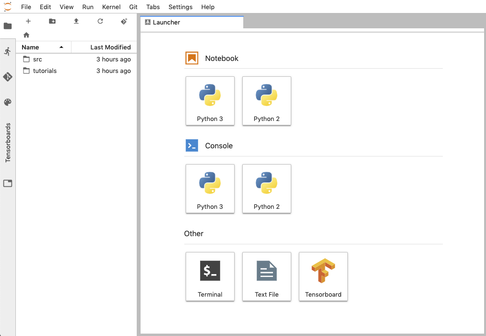
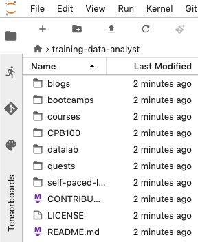

# Lab-2: Exploring and Creating ML Datasets

> * Last Tested Date: DEC 03, 2018
> * Last Updated Date: JUL 01, 2019


## Overview

This lab is part of a lab series, where you go from exploring a taxicab dataset to training and deploying a high-accuracy distributed model with AI model.

### What you need

Logged into GCP Console with your Qwiklabs generated account

### What you learn

In this lab, you will:

* Explore a dataset using BigQuery and Datalab
* Sample the dataset and create training, validation, and testing datasets for local development of TensorFlow models
* Create a benchmark to evaluate the performance of ML against

---
## Setup

For each lab, you get a new GCP project and set of resources for a fixed time at no cost.

1. Make sure you signed into Qwiklabs using an **incognito window**.
2. Note the lab's access time (for example, `02:00:00` and make sure you can finish in that time block.
    * There is no pause feature. You can restart if needed, but you have to start at the beginning.
3. When ready, click `START LAB`.
4. Note your lab credentials. You will use them to sign in to `Cloud Platform Console`.
    
5. Click `Open Google Console`.
6. Click `Use another account` and copy/paste credentials for this lab into the prompts.
    * If you use other credentials, you'll get errors or **incur charges**.
7. Accept the terms and skip the recovery resource page.
    * Do not click `End Lab` unless you are finished with the lab or want to restart it. This clears your work and removes the project.

---
## Launch AI Platform Notebooks

To launch AI Platform Notebooks:

1. Click on the **Navigation Menu**. Navigate to `AI Platforms`, then to `Notebooks`.
    
2. On the Notebook instances page, click `+ NEW INSTANCE`. Select `TensorFlow 1.x`.
    
    * In the pop-up, confirm the name of the deep learning VM and click `CREATE`.
        
    * The new VM will take 2-3 minutes to start.
3. Click `Open JupyterLab`. A JupyterLab window will open in a new tab.
    

---
## Clone Course Repo within Your AI Platform Notebooks Instance

To clone the `training-data-analyst` notebook in your JupyterLab instance:

1. In JupyterLab, click the `Terminal` icon to open a new terminal.
    
2. At the command-line prompt, type in the following command and press `Enter`.
    ```bash
    $ git clone https://github.com/GoogleCloudPlatform/training-data-analyst 
    ```
3. Confirm that you have cloned the repository by double clicking on the `training-data-analyst` directory and ensuring that you can see its contents. The files for all the Jupyter notebook-based labs throughout this course are available in this directory.
    

---
## Explore Dataset, Create ML Datasets, Create benchmark

1. In the notebook interface, navigate to `training-data-analyst > courses > machine_learning > deepdive > 02_generalization > labs` and open `create_datasets.ipynb`.
    * This notebook is your cloned copy of the one in the course repository. Any code changes you make and run here are reflected only in your working copy (until you share with others). This way you can edit and run the code to practice the concepts.
2. In the notebook interface, click on `Edit > Clear All Outputs` (click on `Edit`, then in the drop-down menu, select `Clear All Outputs`).

---
## End Your Lab

1. When you have completed your lab, click `End Lab`. Qwiklabs removes the resources you’ve used and cleans the account for you.
2. You will be given an opportunity to rate the lab experience. Select the applicable number of stars, type a comment, and then click `Submit`.
    * The number of stars indicates the following:
        * 1 star = Very dissatisfied
        * 2 stars = Dissatisfied
        * 3 stars = Neutral
        * 4 stars = Satisfied
        * 5 stars = Very satisfied
3. You can close the dialog box if you don't want to provide feedback.
4. For feedback, suggestions, or corrections, please use the `Support` tab.

---
> ©2019 Google LLC All rights reserved. Google and the Google logo are trademarks of Google LLC. All other company and product names may be trademarks of the respective companies with which they are associated.